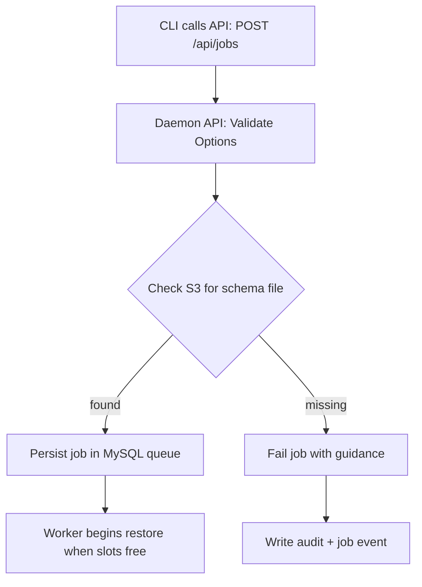
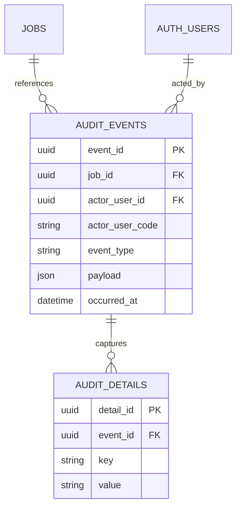
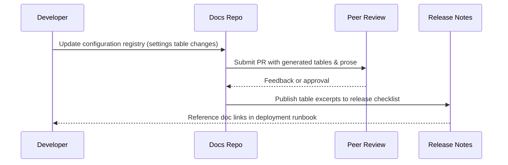
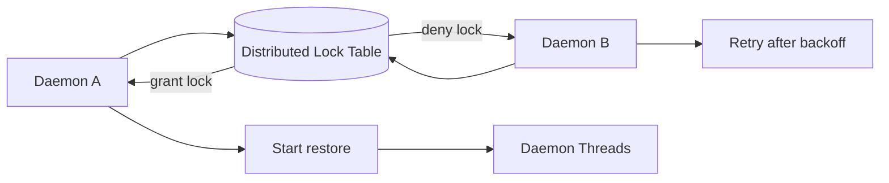
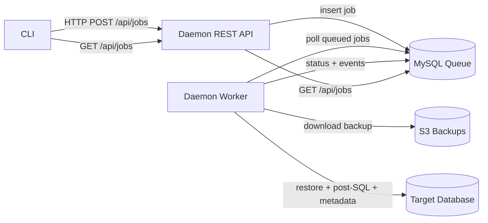
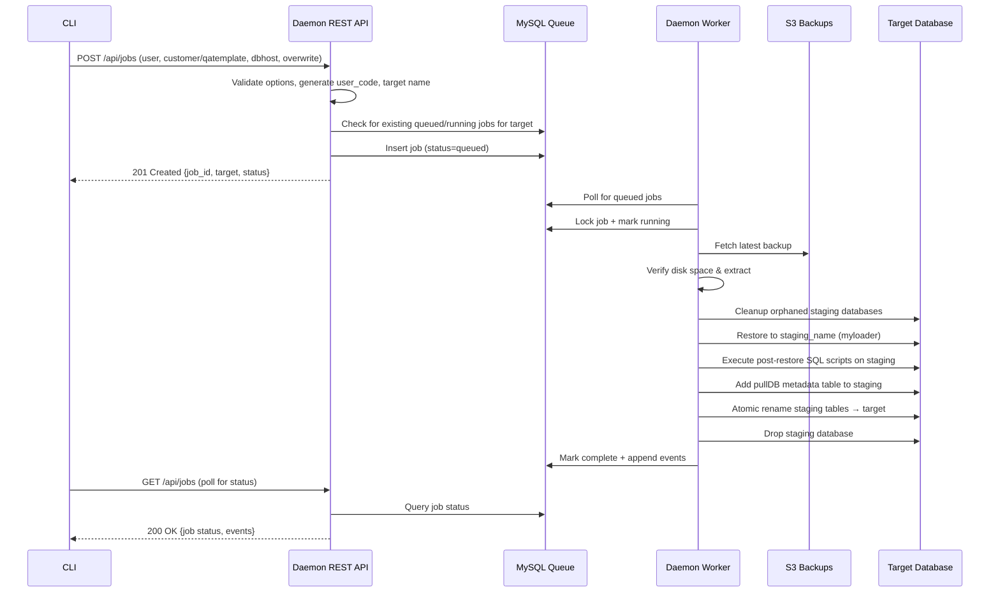

# pullDB Tool

[](https://github.com/PestRoutes/infra.devops/releases/latest)
[](LICENSE)
[](https://www.python.org/downloads/)
[](pulldb/tests/)
[](pulldb/)

> **For AI Agents & New Developers**: Start with `.github/copilot-instructions.md` for architectural overview and critical constraints, then read `constitution.md` for coding standards and workflow. This README provides complete API reference and usage patterns.

> **Engineering DNA**: Shared development protocols (FAIL HARD, Hygiene, Timeout Monitoring) are available via the `engineering-dna` submodule. See `engineering-dna/README.md` for complete documentation and `docs/engineering-dna-dev.md` for adoption guidance.

> Naming note: The repository root keeps the historical product name `pullDB` (capital D) for familiarity, while the Python importable package is lowercase `pulldb` per PEP 8—use `import pulldb...` in code and retain `pullDB` in user-facing docs/CLI branding.

## 📚 Quick Links
- **[Testing Guide](docs/testing.md)** - Running tests with AWS integration

## Quick Start

```bash
# Interactive installer (preferred)
sudo scripts/install_pulldb.sh

# 1. Install AWS CLI
sudo scripts/setup-aws.sh

# 2. Configure AWS credentials (creates .env file)
scripts/setup-aws-credentials.sh
# Follow prompts to:
#   - Configure AWS profile: aws configure --profile pr-staging  (staging-first for prototype)
#   - Edit .env and set PULLDB_AWS_PROFILE=pr-staging (switch to pr-prod only for production backup access)
#   - Verify credentials work
# NOTE: Authentication, cross-account S3 access, and instance profile setup are fully documented in:
#   - docs/AWS-SETUP.md (CANONICAL AWS guide - consolidated)
# TESTS: All integration/repository tests resolve DB credentials from the development account Secrets Manager secret `/pulldb/mysql/coordination-db` (dev account only; not replicated to staging/prod). See docs/AWS-SETUP.md. No direct MySQL user credentials are allowed.

# 3. Install MySQL and load the coordination schema
sudo scripts/setup-mysql.sh
cat schema/pulldb/*.sql | mysql -u root -p

# 4. Set up Python environment
python3 -m venv venv
source venv/bin/activate
python -m pip install --upgrade pip
python -m pip install -e .[dev]

# 5. Use pullDB (once implementation is complete)
pulldb --help

Two supported installation paths:

1. Interactive/non-interactive script (recommended for first-time setup):
```bash
sudo scripts/install_pulldb.sh                    # fully interactive prompts
sudo scripts/install_pulldb.sh --yes \            # auto-confirm
  --prefix /opt/pulldb.service.service \                  # custom install prefix
  --aws-profile dev \                             # set AWS profile
  --secret /pulldb/mysql/coordination-db \        # coordination DB secret
  --validate                                      # attempt AWS + secret checks
```
Prompts for:
- Install directory (defaults /opt/pulldb.service.service)
- AWS profile (PULLDB_AWS_PROFILE)

Script flags:
| Flag | Purpose |
|------|---------|
| `--prefix DIR` | Install path (default `/opt/pulldb.service.service`) |
| `--aws-profile NAME` | Sets `PULLDB_AWS_PROFILE` in `.env` |
| `--secret NAME` | Sets `PULLDB_COORDINATION_SECRET` in `.env` |
| `--yes` | Assume yes for confirmations (non-interactive) |
| `--no-systemd` | Skip systemd unit install/enable |
| `--validate` | Run lightweight AWS profile + secret existence checks (warn-only) |
| `--python BIN` | Alternate Python interpreter for virtualenv |
| `--help` | Display usage and exit |

Validation notes:
- `--validate` invokes `aws sts get-caller-identity` and `aws secretsmanager describe-secret` (warnings only; does not abort on failure).
- Ensure AWS CLI is installed and profile configured prior to using `--validate`.

2. Debian package build (prototype skeleton with maintainer scripts):
```bash
./scripts/build_deb.sh
sudo dpkg -i pulldb_0.0.1.dev0_amd64.deb
sudo /opt/pulldb.service/scripts/install_pulldb.sh --yes --validate  # finalize & customize
```
The .deb lays down `/opt/pulldb.service.service` with installer, unit template, and creates a system user `pulldb` plus initial directory layout (`logs`, `work`, `scripts`). Maintainer `postinst` writes a baseline `.env` and installs the unit file under `/etc/systemd/system/pulldb-worker.service` (disabled by default). Use the installer script for customization after package installation.

Package lifecycle behaviors:
| Script | Behavior |
|--------|----------|
| `postinst` | Create `pulldb` system user, directory layout, write `.env`, copy unit, `systemctl daemon-reload`, enable unit (not started) |
| `prerm` | Stop + disable unit if present |
| `postrm (purge)` | Remove unit file, reload systemd, delete install prefix |

Systemd unit template: `scripts/pulldb-worker.service` (EnvironmentFile auto-injected by installer). After installation you can:
```bash
sudo systemctl enable pulldb-worker.service
sudo systemctl start pulldb-worker.service
```

Verify:
```bash
systemctl status pulldb-worker.service
journalctl -u pulldb-worker -o cat --since "5 minutes ago"
```

Uninstall (manual prototype procedure, if not using dpkg purge):
```bash
sudo systemctl stop pulldb-worker.service || true
sudo systemctl disable pulldb-worker.service || true
sudo rm -f /etc/systemd/system/pulldb-worker.service
sudo systemctl daemon-reload
sudo rm -rf /opt/pulldb.service
```
Or using dpkg purge (invokes `postrm` cleanup):
```bash
sudo dpkg --purge pulldb
```
```

### Custom Installation Path

While `/opt/pulldb.service` is the default installation directory, you can customize
the installation path using the `--prefix` flag:

```bash
# Install to a custom location
sudo scripts/install_pulldb.sh --prefix /custom/path/pulldb --yes

# All configurations, systemd units, and documentation will reference the custom path
```

When using a custom path:
1. The `.env` file will be created at `<prefix>/.env`
2. The virtualenv will be at `<prefix>/venv`
3. Systemd units will be configured with `EnvironmentFile=<prefix>/.env`
4. Logs and work directories can also be customized via `--log-dir` and `--work-dir`

**Note**: If you change the installation path, update any scripts or documentation that
reference the default `/opt/pulldb.service` path to match your custom location.

Documentation:
- MySQL Database Schema: [docs/mysql-schema.md](docs/mysql-schema.md)

### Binary Artifacts Directory

All vendor-provided binaries (multiple myloader builds, historical PHP helpers,
and captured restore artifacts) now live under `pulldb/binaries/`. This keeps
them co-located with the Python package while preventing accidental mixing with
source modules. Validate the directory exists and review its contents with:

```bash
ls -la pulldb/binaries
```

Typical contents include versioned myloader folders (e.g., `myloader-0.19.3-3`),
legacy helper bundles (`pullDB-auth`, `pullQA-auth`), and customer-specific
extractions captured during investigations. When new binaries are added for
testing, drop them into this directory so documentation and automation can make
consistent assumptions about their location.

### Configuration Validation

After completing environment setup you can run the consolidated validator:

```bash
scripts/validate-config.sh
```

It checks:
- AWS profile usability (STS)
- Parameter Store references (if any values start with `/`)
- MySQL connectivity to coordination database
- Work directory writability
- Presence of `settings` table

## Purpose

`pullDB` pulls production database backups from S3 and restores them into development environments. The prototype architecture consists of three services: a CLI that calls an API service, an API service that manages job requests via MySQL, and a worker service that executes restores. The services coordinate exclusively through MySQL.

### Current Implementation Status (Nov 3 2025) - Phase 0: 100% Complete (Release Freeze Initiated)

**Major Achievement**: Core restore workflow complete and tested (181/181 tests passing; 1 skipped, 1 xpassed). The system accepts restore jobs via CLI, lists active jobs with `pulldb status`, orchestrates complete database restores (staging → myloader → post-SQL → metadata → atomic rename), emits structured logs/metrics, and runs under a systemd-managed daemon (graceful shutdown confirmed). Project entered release freeze (bug/security fixes only) on Nov 3 2025 after final installer + packaging & daemon service runner validation.

**Completed Milestones**:
- ✅ Milestone 1: Foundation (MySQL schema, config, credentials, logging) - 100%
- ✅ Milestone 2: Repository Layer (4 repositories, domain models, 87 tests) - 100%
- ✅ Milestone 2.5: Worker Foundation (restore workflow, 48 tests) - 100%
- ✅ Milestone 2.6: Atomic Rename Enhancements (deployment tooling, 14 tests) - 100%
- ✅ Milestone 3: CLI Implementation (parser/validator/enqueue/status complete) - 100%
- ✅ Milestone 5: S3 Integration (discovery, download, disk capacity) - 100%
- ✅ Milestone 6: MySQL Restore (staging pattern, myloader, atomic rename) - 100%
- ✅ Milestone 7: Post-Restore SQL (script execution, metadata injection) - 100%
- ✅ Milestone 8: Logging & Metrics (JSON logging, metrics emission) - 100%
- ✅ Milestone 9: Testing (175 tests, 100% pass rate) - 100%
- ✅ Milestone 10: Deployment (daemon service runner + systemd unit + packaging + installer tests) - 100%

**Test Suite**: 181 passing tests, 1 skipped, 1 xpassed (75.14s total execution, 60s timeout per test)
- 87 repository + integration tests
- 23 worker unit tests
- 25+ integration tests (happy path + failure modes)
- 14 deployment + benchmark tests
- 14 secrets tests
- 7 config tests
- 5 CLI tests (status command)
- 6 installer tests (flags, validation, systemd skip, root enforcement)

**Remaining Work (Release Readiness)**:
1. Production deployment & 2-week stability monitoring window
2. Prepare Phase 1 roadmap refinement (post-freeze)

**Complete Status Report**: See `STATUS-REPORT-2025-11-03.md` (with addendum) for detailed milestone breakdown, metrics, and recommendations.

### Release Freeze (Nov 3 2025)

The project is now in a release freeze. Only the following change categories are permitted until post‑deployment stability sign‑off:

| Allowed | Description |
|---------|-------------|
| Bug Fix | Correct behavior that deviates from documented design |
| Security Fix | Address vulnerabilities (dependency CVE, secret exposure) |
| Critical Ops | Deployment scripting reliability (non-feature) |
| Documentation Correction | Factual updates (no new feature docs) |

| Disallowed | Rationale |
|------------|-----------|
| New Features | Risk of scope creep; deferred to Phase 1 |
| Refactors Without Defect | Freeze preserves stability |
| Performance Optimizations | Profile & optimize post-release |
| Non-critical Style Tweaks | Avoid churn before release |

Freeze Exit Criteria:
1. ≥10 successful production restores
2. Zero unhandled exceptions in daemon logs over 14 days
3. Average restore duration < 30 minutes
4. Metrics (queue depth, disk failures) validated in monitoring
5. Post‑SQL scripts all succeed for customer & QA template restores
6. Staging cleanup consistently removes orphaned staging DBs
7. Security scan (dependencies + secrets) clean

See `RELEASE-FREEZE.md` for authoritative policy.

### Engineering DNA Integration

The `engineering-dna` submodule (https://github.com/CharlesHandshy/engineering-dna) provides:

- Enforcement scripts: `precommit-verify.py`, `ensure_fail_hard.py`, `drift_auditor.py`.
- JSON Schema: `engineering-dna/schemas/dna-config.schema.json` (future gating config).
- Standards: Python, SQL, Shell, Markdown, YAML with linter configurations.

Planned adoption sequence:
1. Pre-commit hook executing `python3 engineering-dna/tools/precommit-verify.py`.
2. CI workflow invoking verify + drift audit.
3. Introduce `dna-config.json` describing enabled gates.

Submodule Update: Run `git submodule update --remote engineering-dna` to pull latest from main branch.

Automated Maintenance:
```bash
# Update submodule to latest main and commit pointer
scripts/update-engineering-dna.sh --push

# Validate freshness during hygiene gates
scripts/precommit-verify.py  # emits warning if behind
```

CI Freshness Enforcement:
The workflow `.github/workflows/engineering-dna-freshness.yml` FAILS if the submodule commit is behind upstream `main`.

Failure diagnostic example:
```
FAIL HARD DIAGNOSTIC
GOAL: Enforce engineering-dna freshness in CI
PROBLEM: Submodule commit (<current>) is behind remote main (<remote>)
ROOT CAUSE: Submodule pointer not updated after upstream changes
SOLUTIONS:
1. Run scripts/update-engineering-dna.sh --push
2. Re-run python3 scripts/precommit-verify.py to confirm freshness
3. (Temporary) If intentional pin, add justification section in README
```

Remediate by advancing the pointer unless an intentional, documented pin exists (pins discouraged during alpha).

Baseline Commit Gate:
The file `.engineering-dna-baseline` defines the minimum required upstream commit SHA. Pre-commit hygiene (`scripts/precommit-verify.py`) FAILS if the submodule pointer differs from this baseline, ensuring mandatory protocol updates are consumed promptly.

To update baseline after upstream changes:
1. Run `scripts/update-engineering-dna.sh --push` to advance pointer.
2. Edit `.engineering-dna-baseline` replacing the SHA with the new required commit (add justification comment if needed).
3. Re-run `python3 scripts/precommit-verify.py` (should pass without baseline failure).
4. Commit and push.

If intentionally deferring (rare): add a comment below the SHA explaining defer reason and target resolution date; remove comment once updated. Deferrals are discouraged during alpha.

Agents and maintainers MUST update this ledger as components are delivered (replace ❌/🚧 with ✅). Do not remove incomplete lines prematurely; preserve historical progression for audit.

## FAIL HARD Standard (pullDB)

All pullDB operations, diagnostics, tests, and architectural changes MUST follow the **FAIL HARD** protocol defined in `constitution.md` and `.github/copilot-instructions.md`.

Protocol Template:
1. Goal – What was attempted (single sentence intent)
2. Problem – Exact symptom or error (verbatim message)
3. Root Cause – Validated reason (evidence-based; no speculation)
4. Ranked Solutions – Ordered list (1 = best alignment, least blast radius)

Non‑Negotiables:
- Never silently degrade or work around failures
- Never return empty success objects for error paths
- Local dev-only overrides MUST emit a diagnostic skip message
- Always preserve tracebacks (`raise ... from e`)
- Error messages MUST include attempted operation + failing subsystem + actionable remediation (copy/paste command when possible)

Example:
```
Goal: Restore customer 'acme' to dev host dev-db-01
Problem: S3 GetObject AccessDenied for key daily_mydumper_acme_2025-11-01T03-15-00Z_Saturday_dbimp.tar
Root Cause: IAM role pulldb-ec2-service-role missing s3:GetObject on prefix pestroutesrdsdbs/daily/stg/acme/
Solutions:
  1. Attach policy pulldb-s3-read-access (least privilege grant)
  2. Add inline statement granting s3:GetObject to specific bucket prefix
  3. Temporary: use staging backup exclusively for format inspection (does not achieve production parity)
```

Automation:
`scripts/ensure_fail_hard.py` (planned) will validate presence of this section across control documents and append if missing.

**Multi-Environment Context**:
- Prototype supports single backup source (staging or production, TBD during implementation)
- **Staging recommended for development**: Contains both mydumper formats for testing
- Full multi-environment support (dev accessing both staging and production backups) is deferred
- Multi-format mydumper support (newer format in staging, older format in production) is deferred
- See `design/roadmap.md` and `docs/backup-formats.md` for full deferred feature documentation

## Development Strategy

- **Prototype first**: deliver the minimal restore loop (CLI + API service + worker service + MySQL job store) before layering on extra commands or services.
- **Service separation**: API service manages requests (no S3/myloader access), worker service executes restores (no HTTP exposure) - see `design/two-service-architecture.md`.
- **Use staging for development**: Staging account contains both mydumper formats, allowing format testing without production access.
- **Single format initially**: prototype will support one mydumper format; multi-format support added pre-production.
- **Single backup source initially**: prototype connects to one S3 bucket (staging recommended); multi-environment support added as needed.
- **Code quality**: All code must follow PEP 8 style guidelines (enforced via ruff and mypy)
- **Bias for simplicity**: avoid optional filters, admin tooling, or aggressive concurrency controls until real usage demands them.
- **Iterate safely**: once the prototype is hardened, grow scope incrementally—revisit queue/service separation, introduce cancellation, filtering, and richer telemetry as distinct follow-up milestones.

### Code Quality Standards

All code follows industry-standard best practices with automated enforcement:

**Standards Documentation**: See [docs/coding-standards.md](docs/coding-standards.md) for comprehensive guidelines covering:
- **Python**: PEP 8, PEP 484 (type hints), Google-style docstrings
- **Markdown**: CommonMark, GitHub Flavored Markdown
- **SQL**: SQL Style Guide (MySQL dialect)
- **Shell Scripts**: Google Shell Style Guide
- **YAML**: YAML 1.2 specification
- **Mermaid**: Diagram best practices

#### Quick Setup

```bash
# Install pre-commit hooks (runs automatically on git commit)
pre-commit install

# Run all quality checks manually
pre-commit run --all-files

# Or run individual tools
ruff check .              # Lint Python code (fast!)
ruff check --fix .        # Lint and auto-fix issues
ruff format .             # Format Python code
mypy pulldb/              # Type check Python
pytest                    # Run tests
ruff rule D101            # Show documentation for specific rule
```

**VS Code Integration**:
- Install the Ruff extension (`charliermarsh.ruff`) for real-time diagnostics as you code
- Errors appear inline with rule codes (e.g., `D101: Missing docstring in public class`)
- AI agents can use the `get_errors` tool to access these diagnostics for proactive error checking
- See `docs/vscode-diagnostics.md` for complete workflow and examples

See `constitution.md` for development workflow and complete coding standards. See `docs/vscode-diagnostics.md` for VS Code diagnostic integration.

### FAIL HARD Enforcement Script

To verify all control documents include the required FAIL HARD sections:

```bash
python3 scripts/ensure_fail_hard.py --check   # Validate presence
python3 scripts/ensure_fail_hard.py --fix     # Auto-append canonical block if missing
```

CI runs the check on every push/PR (workflow: `.github/workflows/fail-hard-check.yml`). Failures must be resolved before merging.

## Prototype Architecture

- **CLI**: Thin client that validates required options, prevents conflicting flags, and calls the API service via HTTP to enqueue restore jobs and query system state. The CLI remains the only user-facing entry point in the prototype.
- **API Service**: Accepts HTTP job requests from CLI, validates input, inserts jobs into MySQL with `status='queued'`, and returns job IDs. Provides status endpoints, backup discovery (read-only S3 listing), and customer listing. Has read-only S3 access (ListBucket, HeadObject) but cannot download archives.
- **Worker Service**: Polls MySQL for jobs with `status='queued'`, acquires per-target locks, performs download/extract/restore tasks, executes post-restore SQL, and emits status updates back into MySQL. Has full S3 read access (GetObject) for downloads but no HTTP exposure.
- **MySQL Coordination Database**: Single source of truth for job state, audit breadcrumbs, and simple per-target locking. Accessed by API service (INSERT/SELECT) and worker service (SELECT/UPDATE). Not accessed by CLI.
- **S3 + Local Storage**: The worker service downloads requested backups on demand (no archive reuse in v0) and stages them locally only for the lifetime of the restore. The API service lists available backups for CLI discovery.

**Service Independence**: API and worker services never communicate directly - only via MySQL queue. This enables independent scaling, deployment, and fault isolation. Both services have S3 access with different permissions: API has read-only listing for discovery, worker has full read for downloads. See `design/two-service-architecture.md` for complete details.

## Usage

### Prototype Option Summary

| Option | Description | Required | Notes |
| --- | --- | --- | --- |
| `user=<name>` | Identity of the operator requesting the restore. | Yes | Must appear first; usernames must contain at least six alphabetic characters (non-letters are stripped) so a unique `user_code` can be derived. |
| `customer=<id>` | Restore the latest backup for a specific customer. | Conditional | Mutually exclusive with `qatemplate`. Restores to `user_code` + sanitized customer token. |
| `qatemplate` | Restore the latest QA template backup. | Conditional | Mutually exclusive with `customer`. Restores to `user_code + 'qatemplate'`. |
| `dbhost=<hostname>` | Target database server when the default development host is not desired. | Optional | Prototype assumes a single default host; override cases must match a pre-registered host entry. |
| `overwrite` | Allow restoring over an existing target database without an interactive prompt. | Optional | When omitted and the target exists, daemon API returns error and CLI exits with guidance to re-run using `overwrite`. |

The CLI fails validation when `customer` and `qatemplate` are supplied together or both omitted. All other historical flags (cancel, history, user admin, filtering, snapshot targeting) are deferred to post-prototype milestones.

### Host Registration Requirements

- All target `dbhost` entries must be registered in the MySQL configuration (`db_hosts` table captures credentials, max active limits, and maximum database counts). The daemon verifies membership before accepting a restore request and fails fast if the host is unknown.
- Credentials are stored securely and surfaced to the daemon through environment configuration on the corresponding EC2 host.
- **Pre-populated Hosts**: Local development is registered during deployment:
  - `localhost` - Local development sandbox (**default**)
  - `dev-db-01` - Development database host

### Migration from Legacy pullDB-auth

Users of the legacy `pullDB-auth` tool should note these mappings:

| Legacy Command | New pullDB Command |
|----------------|-------------------|
| `pullDB --db=customer --user=jdoe` | `pullDB user=jdoe customer=customer` |
| `pullDB --db=customer --user=jdoe --type=SUPPORT` | `pullDB user=jdoe customer=customer` (default) |

**Key Differences**:
- The `--type=` parameter is replaced by explicit `dbhost=` for clarity
- Default behavior now targets the local sandbox (`localhost`)
- Database host registration is now dynamic via `db_hosts` table instead of hardcoded switch statements

### Default Naming Rules

- `user_code` is generated from the first six alphabetic characters of the provided username after stripping non-letters and lowercasing the result. If fewer than six alphabetic characters remain, the request is rejected.
- When a collision occurs, the system replaces the sixth character with the next unused alphabetic character found later in the username, then shifts left to the fifth and fourth characters as needed (up to three adjustments). Failure to produce a unique code aborts provisioning.
- Default target database names concatenate the operator's `user_code` with the sanitized customer token (customer identifier lowercased, non-letters removed). For the QA template, the suffix literal `qatemplate` is used.
- **Length Limit**: Target database names are limited to **51 characters maximum** to accommodate the staging database suffix (`_` + 12-character job_id prefix = 13 chars). This ensures staging names stay within MySQL's 64-character database name limit.
  - `user_code`: 6 characters (fixed)
  - `sanitized_customer_id`: maximum 45 characters (51 - 6 = 45)
  - `qatemplate`: 10 characters (6 + 10 = 16 total, well under limit)
  - Staging suffix: 13 characters (`_` + 12-char job_id)
  - Total staging name: maximum 64 characters (51 + 13)
- The CLI validates target name length during option parsing and rejects requests that would exceed the 51-character limit.
- Sanitized target names are validated by the CLI and daemon, stored in MySQL by the daemon, and reused consistently during restore operations.

### Authentication Model

- Operators authenticate to the infrastructure (Ubuntu host + sudo) before invoking the CLI; no additional prompt is presented by `pullDB`.
- The supervising wrapper runs the agent under `sudo` and injects the `user=` option from trusted context, preventing end users from spoofing identities.
- Queue authorization is still enforced via `auth_users`; attempts to run as unregistered identities are rejected and logged.

### Example Invocation

```bash
pullDB \
  user=jdoe \
  customer=acme \
  dbhost=dev-db-01
```

## Deferred: Admin Operations

> These commands are out of scope for the prototype and remain documented here to capture the intended follow-up work.

- **User Provisioning**: `user-add=<name[,admin]>` inserts a new record into `auth_users`. When omitting `,admin`, the user is non-admin by default. The daemon derives a six-character `user_code` from the first six alphabetic characters of the username after stripping non-letters and lowercasing. If that code already exists, it replaces the sixth character with the next unused alphabetic character later in the username; if collisions persist, it progressively substitutes the fifth (then fourth) character, consuming additional unused letters, and stops after three positions. If no unique code emerges, creation aborts. Admin status is logged to both audit and general log streams.
- **User Removal**: `user-remove=<name>` marks the user as disabled (`disabled_at` timestamp). Jobs owned by the user remain immutable for audit purposes.
- **Privilege Changes**: `user-admin=<name>,y|n` toggles the `is_admin` flag. Each change records the acting admin and reason in `job_events` (admin maintenance) and the audit log.
- **User Listing**: `user-list` returns usernames with their admin designation for quick verification.
- **Authorization Rules**: only admins may execute user-management commands or cancel jobs they do not own. Usernames with fewer than six alphabetic characters (after stripping non-letters) are rejected. Admin promotions or demotions are logged but do not trigger direct notifications to the affected user. All operations that alter `auth_users` are wrapped in queue locks to prevent race conditions across agents.

## Prototype Operational Commands

### Status Query
- `pullDB status`: prints queue depth, disk headroom, and active restore count as observed by the API service (which queries MySQL and optionally worker-reported metrics). Non-admin views match admin views in the prototype (admins-only visibility arrives later).

### Discovery Commands (Prototype)
- `pullDB list-backups [customer=<id>|qatemplate]`: Lists available backups in S3 for the specified customer or QA template. API service queries S3 (read-only ListBucket) and returns backup names, timestamps, and sizes. Helps users verify backup availability before requesting restore.
- `pullDB list-customers`: Lists all customer IDs with available backups in S3. API service scans S3 prefixes and returns customer list with latest backup timestamps. Useful for discovering what can be restored.

### Job Management
- `pulldb status [job_id]`: Shows active jobs, or filter by a specific job.
- `pulldb cancel <job_id>`: Cancel a queued or running job.
- `pulldb events <job_id>`: Show event history for a specific job.
- `pulldb profile <job_id>`: Show performance profile for a completed job.
- `pulldb history`: Show completed/failed/canceled jobs with filtering options.

**Short Job ID Prefixes**: All commands accepting a job_id support 8+ character prefixes instead of full UUIDs. For example, `pulldb cancel 8b4c4a3a` instead of `pulldb cancel 8b4c4a3a-85a1-4da2-9636-84c1d70a2159`. If multiple jobs match the prefix, you'll be prompted to select one interactively.

**Note**: All discovery commands are implemented as HTTP calls to API service endpoints. The API service has read-only S3 access (ListBucket, HeadObject) specifically to support these commands without requiring CLI to have AWS credentials.

## Retry Policy

- Jobs do not retry automatically after failure. Operators must inspect the failure reason, address the root cause, and resubmit a fresh request if appropriate.
- The daemon records failure details in `job_events` and increments `retry_count` for diagnostics but does not schedule a reattempt.

## Data Retention

- Queue entries (including job history and logs) remain in MySQL for 90 days. A maintenance task prunes older records while ensuring the core Datadog metrics (queue depth, disk failures) continue to reflect current state.
- Datadog log ingestion retains the single-line history output and operational logs indefinitely according to existing retention policies.

## Restored Database Lifecycle

- Restored databases remain on development hosts until operators remove them manually or through separate lifecycle tooling.
- The daemon performs no automatic pruning beyond temporary working directories; environment owners decide when to drop restored databases.

## Metrics and Monitoring

- The daemon emits two day-one metrics to Datadog: queue depth and disk-capacity failures. These power the primary alerts for prototype operations.
- Additional visibility comes from structured logs (phase transitions, restore results, post-restore SQL execution, failures). Cancellation-specific logging arrives with the future cancel command.

## Release Management

- The CLI and daemon ship as a single versioned bundle for the prototype; deploy them together to keep migrations and binaries aligned.
- Schema migrations apply before restarting the daemon. Once migrations succeed, recycle the daemon and update the CLI wrapper during the same maintenance window.
- Downgrades are not supported without restoring MySQL from backup. Keep a recent snapshot prior to upgrading.

## Prototype Queue Data Model

- **auth_users**: `user_id` (UUID), `username` (unique), `user_code`, `is_admin`, `created_at`, `disabled_at`. Admin-specific fields remain for future expansion even though prototype exposes no admin commands.
- **jobs**: `id` (UUID), `owner_user_id`, `owner_username`, `owner_user_code`, `target`, `status`, `submitted_at`, `started_at`, `completed_at`, `options_json`, `retry_count`, `error_detail`.
- **job_events**: append-only log with `job_id`, `event_time`, `event_type`, `actor_user_id`, `actor_username`, `detail`. Used for troubleshooting without a dedicated history endpoint.
- **db_hosts**: registry of allowable restore targets containing credentials references and `max_db_count` for safety checks.
- **locks**: simple advisory rows keyed by target database name to serialize restores and prevent duplicate jobs.

Tables such as `history_cache`, per-user/host concurrency overrides, and detailed job log fan-out remain defined in `docs/mysql-schema.md` but are not required for the prototype runtime.

## Process Flow

### Discovery
- Parse and validate CLI options, ensuring either `customer` or `qatemplate` is present.
- Query the S3 bucket for the most recent backup that matches the requested target.
  - Bucket path: `pestroutes-rds-backup-prod-vpc-us-east-1-s3/daily/prod/<customer|qatemplate>`.
  - Filenames follow `daily_mydumper_<target>_<YYYY-MM-DDThh-mm-ssZ>_<Day>_dbimp.tar` where the `dbimp` segment is either `db01`-`db11` or `imp`.
- Create a queue record with `queued` status and timestamp; the daemon updates `started_at` when execution begins.

### Download and Extraction
- Confirm required files exist before transfer (`*-schema-create.sql.zst` must be present); if missing, fail fast to avoid wasted downloads.
- Download the archive for every run, extract into a working area, and purge temporary files after the restore completes.
- Before extraction, fetch the object size from S3 and ensure at least `size * 1.8` free space is available on the data directory volume.
- CLI invocations may run in parallel; the daemon uses MySQL locks keyed by target database name to prevent duplicate restores.

### Disk Capacity Management (Daemon)

- The daemon measures available disk space before starting extraction. Required space equals `tar_size + (tar_size * 1.8)` to cover overhead. If the volume cannot satisfy the requirement, the job fails fast with guidance to free space.
- Prototype cleanup removes only the temporary working directory for the in-flight job. Automatic pruning of historical restores is deferred; operators handle manual cleanup as needed.

### Deferred: Filtering
- Filtering flags (`exclude`, `excludedefaults`, `nodata`) are not implemented in the prototype. When reintroduced, the daemon will remove matching artifacts post-extraction and revalidate required schema files before restoring.

### Restore Execution
- Create the target database name (`user_code` + sanitized customer token or `qatemplate`). Prototype forbids custom overrides.
- If the target database already exists and `overwrite` was not supplied, the CLI queries the daemon API which checks the database and returns an error with instructions to rerun using `overwrite`.
- Before starting work, the daemon verifies the designated `dbhost` is registered and checks that the projected database count does not exceed the configured limit. If it would, the job fails fast with guidance to free capacity.
- The daemon updates `started_at` and `status=running` before executing download/extract/restore steps. Single-threaded per-target locks prevent concurrent restores for the same destination.
- After a successful restore, the daemon executes SQL files from the appropriate directory (`customers_after_sql/` for customer restores, `qa_template_after_sql/` for QA template restores) and adds a single `pullDB` table to the restored database containing restore metadata (user who restored, restore timestamp, backup filename used, and JSON report of post-restore SQL script execution status).
- All major phase transitions (download complete, extraction complete, restore finished, post-restore SQL executed, metadata table added) produce job event rows for troubleshooting.

## Deferred: History Output Format

- The prototype excludes the `history=` command. The notes below remain as guidance for the eventual implementation.
- Output will be newline-delimited JSON with ordered keys: `job_id`, `owner_user_id`, `owner_username`, `owner_user_code`, `target`, `status`, `submitted_at`, `started_at`, `completed_at`, `job_options_present`, `backup_name`, `size_bytes`, `duration_seconds`, `history_options_present`, `exdefaults_used`, `exclude_tables_used`, `exclude_tables`, `nodata_used`, `nodata_tables`.
- Boolean flags (`job_options_present`, `history_options_present`, `exdefaults_used`, `nodata_used`) provide quick scanning without parsing arrays.
- Pagination parameters (`limit`, `start_date`) should remain optional yet encouraged to cap payload sizes.

## Prototype Configuration

- `settings` table stores the default extraction directory, default `dbhost`, S3 bucket configuration, post-restore SQL script directories, and other operational parameters.
- Per-target database caps live in `db_hosts.max_db_count`; the daemon reads this value before starting a restore.
- **Concurrency Controls** (Phase 2, v0.0.4): Per-user and global active job limits are enforced via `max_active_jobs_per_user` and `max_active_jobs_global` settings. A value of 0 means unlimited. See `docs/concurrency-controls.md` for configuration.
- Historical retention knobs (`history_retention_days`, detailed log pruning) will matter once history endpoints exist; keep placeholders but avoid implementing maintenance tasks until needed.

## Validation and Safeguards

1. Verify `user=` against `auth_users` in daemon API before accepting a restore; ensure six alphabetic characters exist to derive a `user_code` and reject duplicates.
2. Honor the `overwrite` flag by having daemon check target database existence and rejecting when it exists without the flag.
3. Ensure every job receives a UUID plus timestamp trio (`submitted`, `started`, `completed`). The daemon owns status transitions and writes them atomically.
4. Validate disk space ahead of extraction using the S3 object size and reject jobs that cannot satisfy the `1.8x` buffer.
5. Per-target exclusivity is enforced via unique constraint on `active_target_key`. Per-user and global limits return HTTP 429 when exceeded (Phase 2).
6. Prevent duplicate queue inserts for the same target by daemon checking existing `queued` or `running` jobs before writing a new record.
7. Check the `dbhost` registration and projected database count before restore. Unknown hosts or over-capacity projections cause the daemon to fail the job immediately.
8. Do not auto-retry failures; capture error context in `job_events` and require operators to resubmit once issues are resolved.

## Prototype Job Lifecycle

- `queued`: request accepted and awaiting daemon pickup.
- `running`: the daemon is actively restoring.
- `failed`: the daemon reported an unrecoverable error.
- `complete`: job finished successfully.
- `canceled`: reserved for future cancellation support (not emitted in the prototype).

## Future Considerations

- Re-evaluate archive reuse and multi-component architecture once the prototype stabilizes.
- Introduce cancellation, history reporting, and admin tooling with corresponding audit coverage.
- ~~Expand concurrency controls beyond per-target locks~~ ✅ Implemented in Phase 2 (v0.0.4): per-user and global caps via settings table.
- Enhance documentation with worked examples for filters, history, and admin flows as features roll out.
- Explore distributed locking or service separation if multiple daemons run concurrently.

## Deferred Functionality Diagrams

### Direct S3 Validation Guardrail



### Audit Log Schema Expansion



### Configuration Documentation Workflow



### Cross-Host Locking Strategy



## Prototype Diagrams

### System Overview



### Restore Lifecycle



## Logging Strategy

- **Audit Logging**: capture authorization failures and other security-related events (e.g., unknown `user=` attempts, host validation failures).
- **General Logging**: record operational events for the CLI wrapper and daemon, including disk checks, download phases, restore timing, post-restore SQL execution, and metadata table creation.

## Development Workflow Note

Before every commit, follow the Pre-Commit Hygiene Protocol (format, lint, types, tests with timeout, drift ledger sync, gitignore audit). Full protocol details live in `.github/copilot-instructions.md`.
- **Job Logging**: emit single-line records for each job transition (queued, running, failed, complete). Cancellation entries will join once that feature ships.

## Documentation

### Setup & Configuration
- [AWS Authentication Setup](docs/aws-authentication-setup.md) - **PRIMARY**: EC2 instance profile with cross-account S3 access (staging + production)
- [AWS Parameter Store Setup](docs/parameter-store-setup.md) - Secure credential storage
- [Two-Service Architecture](design/two-service-architecture.md) - API Service + Worker Service separation

### Architecture & Schema
- [MySQL Schema Documentation](docs/mysql-schema.md) - Complete database schema reference
- [System Overview](design/system-overview.md) - Component responsibilities and interactions
- [Configuration Map](design/configuration-map.md) - Configuration sources and precedence

### Development
- [Copilot Instructions](.github/copilot-instructions.md) - AI agent architecture reference
- [Constitution](constitution.md) - Coding standards and development workflow
