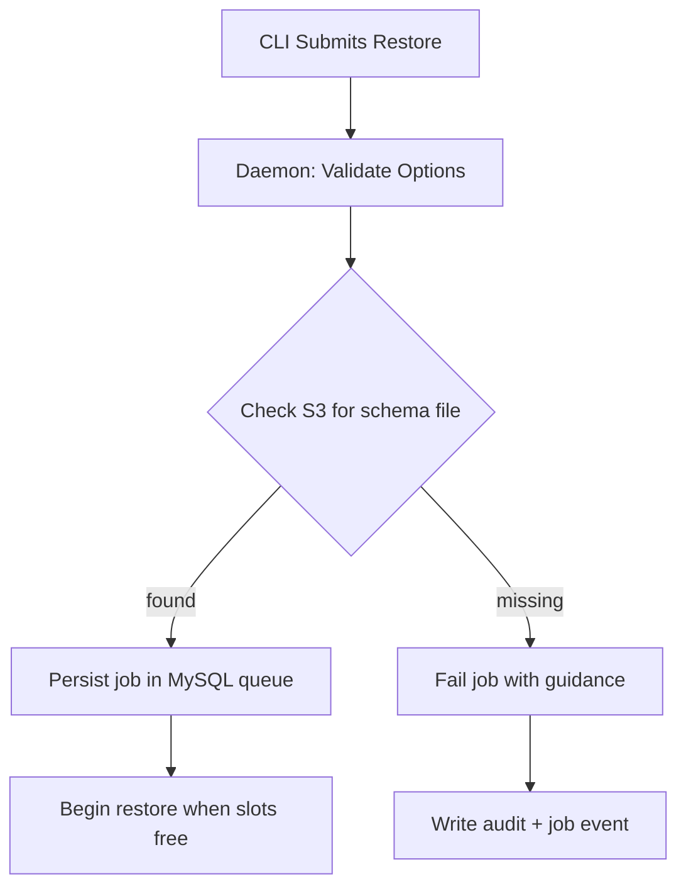
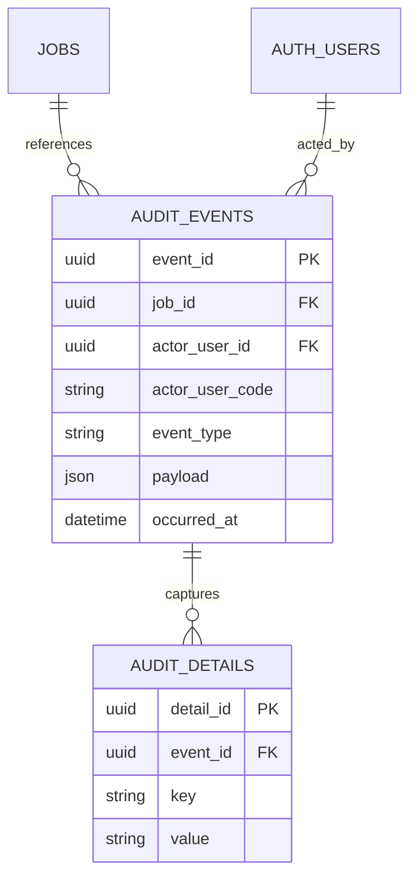
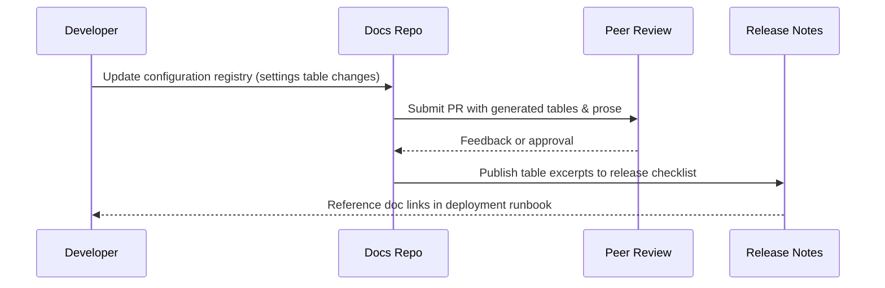
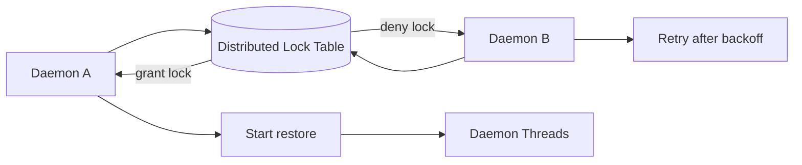
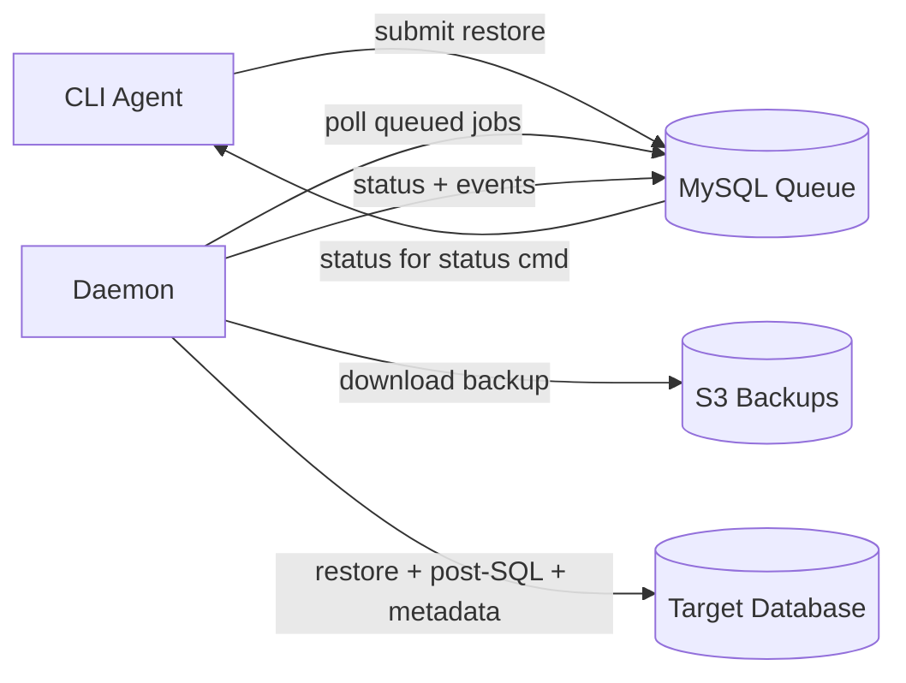
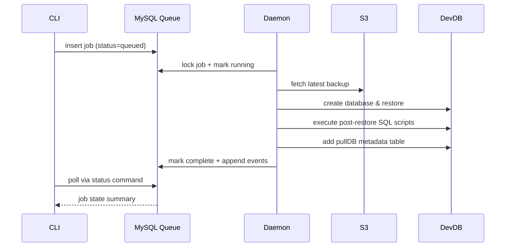

# pullDB Tool

> **For AI Agents & New Developers**: Start with `.github/copilot-instructions.md` for architectural overview and critical constraints, then read `constitution.md` for coding standards and workflow. This README provides complete API reference and usage patterns.

## Quick Start

```bash
# 1. Install AWS CLI (optional profile configuration)
sudo scripts/setup-aws.sh
# sudo scripts/setup-aws.sh --configure pr-prod us-east-1 json

# 2. Install MySQL and create database schema
sudo scripts/setup-mysql.sh
sudo scripts/setup-pulldb-schema.sh

# 3. Set up Python environment
python3 -m venv venv
source venv/bin/activate
scripts/setup-python-project.sh

# 4. Use pullDB (once implementation is complete)
pulldb --help
pulldb-daemon
```

Documentation:
- AWS Setup: [docs/aws-setup.md](docs/aws-setup.md)
- MySQL Setup: [docs/mysql-setup.md](docs/mysql-setup.md)
- Python Project Setup: [docs/python-project-setup.md](docs/python-project-setup.md)

## Purpose

`pullDB` pulls production database backups from S3, stores them in a local archive, and restores them into development environments. The prototype release keeps the surface tight: a CLI funnels requests into MySQL and a single long-running daemon validates, queues, and executes the restores end-to-end. We will reintroduce additional components once the simplified flow proves reliable.

## Development Strategy

- **Prototype first**: deliver the minimal restore loop (CLI + daemon + MySQL job store) before layering on extra commands or services.
- **Bias for simplicity**: avoid optional filters, admin tooling, or aggressive concurrency controls until real usage demands them.
- **Iterate safely**: once the prototype is hardened, grow scope incrementally—revisit queue/service separation, introduce cancellation, filtering, and richer telemetry as distinct follow-up milestones.

## Prototype Architecture

- **CLI (Agent)**: validates required options, prevents conflicting flags, and inserts restore jobs into MySQL. The CLI remains the only user-facing entry point in the prototype.
- **Daemon**: combines the former queue service and worker roles. It runs continuously, dequeues pending work, performs download/extract/restore tasks, and emits status updates back into MySQL.
- **MySQL Queue**: single source of truth for job state, audit breadcrumbs, and simple per-target locking. Both the CLI and daemon collaborate solely through this datastore.
- **S3 + Local Storage**: the daemon always downloads requested backups (no archive reuse in v0) and stages them locally only for the lifetime of the restore.

## Usage

### Prototype Option Summary

| Option | Description | Required | Notes |
| --- | --- | --- | --- |
| `user=<name>` | Identity of the operator requesting the restore. | Yes | Must appear first; usernames must contain at least six alphabetic characters (non-letters are stripped) so a unique `user_code` can be derived. |
| `customer=<id>` | Restore the latest backup for a specific customer. | Conditional | Mutually exclusive with `qatemplate`. Restores to `user_code` + sanitized customer token. |
| `qatemplate` | Restore the latest QA template backup. | Conditional | Mutually exclusive with `customer`. Restores to `user_code + 'qatemplate'`. |
| `dbhost=<hostname>` | Target database server when the default development host is not desired. | Optional | Prototype assumes a single default host; override cases must match a pre-registered host entry. |
| `overwrite` | Allow restoring over an existing target database without an interactive prompt. | Optional | When omitted and the target exists, the CLI exits with guidance to re-run using `--overwrite`. |

The CLI fails validation when `customer` and `qatemplate` are supplied together or both omitted. All other historical flags (cancel, history, user admin, filtering, snapshot targeting) are deferred to post-prototype milestones.

### Host Registration Requirements

- All target `dbhost` entries must be registered in the MySQL configuration (`db_hosts` table captures credentials, max active limits, and maximum database counts). The agent verifies membership before accepting a restore request and fails fast if the host is unknown.
- Credentials are stored securely and surfaced to the daemon through environment configuration on the corresponding EC2 host.
- **Pre-populated Hosts**: Three database servers are registered during deployment to support legacy team segregation:
  - `db-mysql-db3-dev` - Development team (legacy `--type=DEV`)
  - `db-mysql-db4-dev` - Support team (legacy `--type=SUPPORT`, **default**)
  - `db-mysql-db5-dev` - Implementation team (legacy `--type=IMPLEMENTATION`)

### Migration from Legacy pullDB-auth

Users of the legacy `pullDB-auth` tool should note these mappings:

| Legacy Command | New pullDB Command |
|----------------|-------------------|
| `pullDB --db=customer --user=jdoe` | `pullDB user=jdoe customer=customer` |
| `pullDB --db=customer --user=jdoe --type=SUPPORT` | `pullDB user=jdoe customer=customer` (default) |
| `pullDB --db=customer --user=jdoe --type=DEV` | `pullDB user=jdoe customer=customer dbhost=db-mysql-db3-dev` |
| `pullDB --db=customer --user=jdoe --type=IMPLEMENTATION` | `pullDB user=jdoe customer=customer dbhost=db-mysql-db5-dev` |

**Key Differences**:
- The `--type=` parameter is replaced by explicit `dbhost=` for clarity
- Default behavior matches legacy SUPPORT (db4 host)
- Short hostnames (`db3-dev`, `db4-dev`, `db5-dev`) are supported alongside full FQDNs
- Database host registration is now dynamic via `db_hosts` table instead of hardcoded switch statements

### Default Naming Rules

- `user_code` is generated from the first six alphabetic characters of the provided username after stripping non-letters and lowercasing the result. If fewer than six alphabetic characters remain, the request is rejected.
- When a collision occurs, the system replaces the sixth character with the next unused alphabetic character found later in the username, then shifts left to the fifth and fourth characters as needed (up to three adjustments). Failure to produce a unique code aborts provisioning.
- Default target database names concatenate the operator's `user_code` with the sanitized customer token (customer identifier lowercased, non-letters removed). For the QA template, the suffix literal `qatemplate` is used.
- **Length Limit**: Target database names are limited to **51 characters maximum** to accommodate the staging database suffix (`_` + 12-character job_id prefix = 13 chars). This ensures staging names stay within MySQL's 64-character database name limit.
  - `user_code`: 6 characters (fixed)
  - `sanitized_customer_id`: maximum 45 characters (51 - 6 = 45)
  - `qatemplate`: 10 characters (6 + 10 = 16 total, well under limit)
  - Staging suffix: 13 characters (`_` + 12-char job_id)
  - Total staging name: maximum 64 characters (51 + 13)
- The CLI validates target name length during option parsing and rejects requests that would exceed the 51-character limit.
- Sanitized target names are stored verbatim in MySQL and reused consistently by the CLI and daemon.

### Authentication Model

- Operators authenticate to the infrastructure (Ubuntu host + sudo) before invoking the CLI; no additional prompt is presented by `pullDB`.
- The supervising wrapper runs the agent under `sudo` and injects the `user=` option from trusted context, preventing end users from spoofing identities.
- Queue authorization is still enforced via `auth_users`; attempts to run as unregistered identities are rejected and logged.

### Example Invocation

```bash
pullDB \
  user=jdoe \
  customer=acme \
  dbhost=dev-db-01
```

## Deferred: Admin Operations

> These commands are out of scope for the prototype and remain documented here to capture the intended follow-up work.

- **User Provisioning**: `user-add=<name[,admin]>` inserts a new record into `auth_users`. When omitting `,admin`, the user is non-admin by default. The daemon derives a six-character `user_code` from the first six alphabetic characters of the username after stripping non-letters and lowercasing. If that code already exists, it replaces the sixth character with the next unused alphabetic character later in the username; if collisions persist, it progressively substitutes the fifth (then fourth) character, consuming additional unused letters, and stops after three positions. If no unique code emerges, creation aborts. Admin status is logged to both audit and general log streams.
- **User Removal**: `user-remove=<name>` marks the user as disabled (`disabled_at` timestamp). Jobs owned by the user remain immutable for audit purposes.
- **Privilege Changes**: `user-admin=<name>,y|n` toggles the `is_admin` flag. Each change records the acting admin and reason in `job_events` (admin maintenance) and the audit log.
- **User Listing**: `user-list` returns usernames with their admin designation for quick verification.
- **Authorization Rules**: only admins may execute user-management commands or cancel jobs they do not own. Usernames with fewer than six alphabetic characters (after stripping non-letters) are rejected. Admin promotions or demotions are logged but do not trigger direct notifications to the affected user. All operations that alter `auth_users` are wrapped in queue locks to prevent race conditions across agents.

## Prototype Operational Commands

- `pullDB status`: prints queue depth, disk headroom, and active restore count as observed by the daemon. Non-admin views match admin views in the prototype (admins-only visibility arrives later).
- Queue listing, cancellation, and history-style reporting are intentionally deferred until the core restore loop proves stable.

## Retry Policy

- Jobs do not retry automatically after failure. Operators must inspect the failure reason, address the root cause, and resubmit a fresh request if appropriate.
- The daemon records failure details in `job_events` and increments `retry_count` for diagnostics but does not schedule a reattempt.

## Data Retention

- Queue entries (including job history and logs) remain in MySQL for 90 days. A maintenance task prunes older records while ensuring the core Datadog metrics (queue depth, disk failures) continue to reflect current state.
- Datadog log ingestion retains the single-line history output and operational logs indefinitely according to existing retention policies.

## Restored Database Lifecycle

- Restored databases remain on development hosts until operators remove them manually or through separate lifecycle tooling.
- The daemon performs no automatic pruning beyond temporary working directories; environment owners decide when to drop restored databases.

## Metrics and Monitoring

- The daemon emits two day-one metrics to Datadog: queue depth and disk-capacity failures. These power the primary alerts for prototype operations.
- Additional visibility comes from structured logs (phase transitions, restore results, post-restore SQL execution, failures). Cancellation-specific logging arrives with the future cancel command.

## Release Management

- The CLI and daemon ship as a single versioned bundle for the prototype; deploy them together to keep migrations and binaries aligned.
- Schema migrations apply before restarting the daemon. Once migrations succeed, recycle the daemon and update the CLI wrapper during the same maintenance window.
- Downgrades are not supported without restoring MySQL from backup. Keep a recent snapshot prior to upgrading.

## Prototype Queue Data Model

- **auth_users**: `user_id` (UUID), `username` (unique), `user_code`, `is_admin`, `created_at`, `disabled_at`. Admin-specific fields remain for future expansion even though prototype exposes no admin commands.
- **jobs**: `id` (UUID), `owner_user_id`, `owner_username`, `owner_user_code`, `target`, `status`, `submitted_at`, `started_at`, `completed_at`, `options_json`, `retry_count`, `error_detail`.
- **job_events**: append-only log with `job_id`, `event_time`, `event_type`, `actor_user_id`, `actor_username`, `detail`. Used for troubleshooting without a dedicated history endpoint.
- **db_hosts**: registry of allowable restore targets containing credentials references and `max_db_count` for safety checks.
- **locks**: simple advisory rows keyed by target database name to serialize restores and prevent duplicate jobs.

Tables such as `history_cache`, per-user/host concurrency overrides, and detailed job log fan-out remain defined in `Tools/pullDB/docs/mysql-schema.md` but are not required for the prototype runtime.

## Process Flow

### Discovery
- Parse and validate CLI options, ensuring either `customer` or `qatemplate` is present.
- Query the S3 bucket for the most recent backup that matches the requested target.
  - Bucket path: `pestroutes-rds-backup-prod-vpc-us-east-1-s3/daily/prod/<customer|qatemplate>`.
  - Filenames follow `daily_mydumper_<target>_<YYYY-MM-DDThh-mm-ssZ>_<Day>_dbimp.tar` where the `dbimp` segment is either `db01`-`db11` or `imp`.
- Create a queue record with `queued` status and timestamp; the daemon updates `started_at` when execution begins.

### Download and Extraction
- Confirm required files exist before transfer (`*-schema-create.sql.zst` must be present); if missing, fail fast to avoid wasted downloads.
- Download the archive for every run, extract into a working area, and purge temporary files after the restore completes.
- Before extraction, fetch the object size from S3 and ensure at least `size * 1.8` free space is available on the data directory volume.
- CLI invocations may run in parallel; they rely on MySQL locks keyed by target database name to prevent duplicate restores.

### Disk Capacity Management (Daemon)

- The daemon measures available disk space before starting extraction. Required space equals `tar_size + (tar_size * 1.8)` to cover overhead. If the volume cannot satisfy the requirement, the job fails fast with guidance to free space.
- Prototype cleanup removes only the temporary working directory for the in-flight job. Automatic pruning of historical restores is deferred; operators handle manual cleanup as needed.

### Deferred: Filtering
- Filtering flags (`exclude`, `excludedefaults`, `nodata`) are not implemented in the prototype. When reintroduced, the daemon will remove matching artifacts post-extraction and revalidate required schema files before restoring.

### Restore Execution
- Create the target database name (`user_code` + sanitized customer token or `qatemplate`). Prototype forbids custom overrides.
- If the target database already exists and `overwrite` was not supplied, the CLI exits prior to queueing the job with instructions to rerun using `--overwrite`.
- Before starting work, the daemon verifies the designated `dbhost` is registered and checks that the projected database count does not exceed the configured limit. If it would, the job fails fast with guidance to free capacity.
- The daemon updates `started_at` and `status=running` before executing download/extract/restore steps. Single-threaded per-target locks prevent concurrent restores for the same destination.
- After a successful restore, the daemon executes SQL files from the appropriate directory (`customers_after_sql/` for customer restores, `qa_template_after_sql/` for QA template restores) and adds a single `pullDB` table to the restored database containing restore metadata (user who restored, restore timestamp, backup filename used, and JSON report of post-restore SQL script execution status).
- All major phase transitions (download complete, extraction complete, restore finished, post-restore SQL executed, metadata table added) produce job event rows for troubleshooting.

## Deferred: History Output Format

- The prototype excludes the `history=` command. The notes below remain as guidance for the eventual implementation.
- Output will be newline-delimited JSON with ordered keys: `job_id`, `owner_user_id`, `owner_username`, `owner_user_code`, `target`, `status`, `submitted_at`, `started_at`, `completed_at`, `job_options_present`, `backup_name`, `size_bytes`, `duration_seconds`, `history_options_present`, `exdefaults_used`, `exclude_tables_used`, `exclude_tables`, `nodata_used`, `nodata_tables`.
- Boolean flags (`job_options_present`, `history_options_present`, `exdefaults_used`, `nodata_used`) provide quick scanning without parsing arrays.
- Pagination parameters (`limit`, `start_date`) should remain optional yet encouraged to cap payload sizes.

## Prototype Configuration

- `settings` table stores the default extraction directory, default `dbhost`, S3 bucket configuration, post-restore SQL script directories, and other operational parameters.
- Per-target database caps live in `db_hosts.max_db_count`; the daemon reads this value before starting a restore.
- Global concurrency limits (`max_active_restoring`, user/host overrides) are deferred. The prototype relies on MySQL locks to serialize per-target restores only.
- Historical retention knobs (`history_retention_days`, detailed log pruning) will matter once history endpoints exist; keep placeholders but avoid implementing maintenance tasks until needed.

## Validation and Safeguards

1. Verify `user=` against `auth_users` before accepting a restore; ensure six alphabetic characters exist to derive a `user_code` and reject duplicates.
2. Honor the `overwrite` flag by checking target database existence in the CLI and aborting early when it is missing.
3. Ensure every job receives a UUID plus timestamp trio (`submitted`, `started`, `completed`). The daemon owns status transitions and writes them atomically.
4. Validate disk space ahead of extraction using the S3 object size and reject jobs that cannot satisfy the `1.8x` buffer.
5. Use MySQL advisory locks to prevent more than one active job per target database name; no additional concurrency tiers are enforced in the prototype.
6. Prevent duplicate queue inserts for the same target by checking existing `queued` or `running` jobs before writing a new record.
7. Check the `dbhost` registration and projected database count before restore. Unknown hosts or over-capacity projections cause the daemon to fail the job immediately.
8. Do not auto-retry failures; capture error context in `job_events` and require operators to resubmit once issues are resolved.

## Prototype Job Lifecycle

- `queued`: request accepted and awaiting daemon pickup.
- `running`: the daemon is actively restoring.
- `failed`: the daemon reported an unrecoverable error.
- `complete`: job finished successfully.
- `canceled`: reserved for future cancellation support (not emitted in the prototype).

## Future Considerations

- Re-evaluate archive reuse and multi-component architecture once the prototype stabilizes.
- Introduce cancellation, history reporting, and admin tooling with corresponding audit coverage.
- Expand concurrency controls beyond per-target locks (per-user/per-host/global caps) when demand appears.
- Enhance documentation with worked examples for filters, history, and admin flows as features roll out.
- Explore distributed locking or service separation if multiple daemons run concurrently.

## Deferred Functionality Diagrams

### Direct S3 Validation Guardrail



### Audit Log Schema Expansion



### Configuration Documentation Workflow



### Cross-Host Locking Strategy



## Prototype Diagrams

### System Overview



### Restore Lifecycle



## Logging Strategy

- **Audit Logging**: capture authorization failures and other security-related events (e.g., unknown `user=` attempts, host validation failures).
- **General Logging**: record operational events for the CLI wrapper and daemon, including disk checks, download phases, restore timing, post-restore SQL execution, and metadata table creation.
- **Job Logging**: emit single-line records for each job transition (queued, running, failed, complete). Cancellation entries will join once that feature ships.
