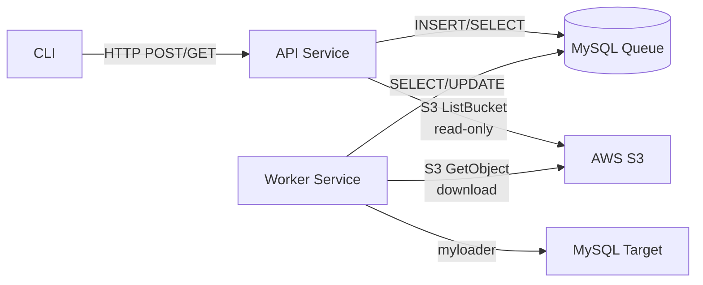

# Two-Service Architecture: API Service and Worker Service

> **Prerequisites**: Read `../.github/copilot-instructions.md` and `../constitution.md` before implementing this architecture.

## Overview

The pullDB system is split into **two independent services** for clean separation of concerns:

1. **API Service** (CLI Manager) - Manages job requests, validation, and status queries
2. **Worker Service** (Queue Manager) - Executes restore jobs from the queue

Both services communicate exclusively through MySQL as the coordination layer. This separation provides:
- **Independent scaling**: Scale API service for request load, worker service for restore throughput
- **Independent deployment**: Deploy API changes without restarting workers (and vice versa)
- **Clear boundaries**: API service never touches S3/myloader, worker service never handles HTTP
- **Resilience**: API service can respond to status queries even if worker is down

## Component Responsibilities

### API Service (CLI Manager)

**Purpose**: Accept and manage restore job requests from CLI

**Responsibilities**:
- Accept HTTP REST requests from CLI
- Validate input parameters (user, customer/qatemplate, dbhost, overwrite)
- Generate user_code from username
- Sanitize and generate target database names
- Check for existing jobs to prevent duplicates
- Insert validated jobs into MySQL `jobs` table
- Query job status and events from MySQL
- List available backups from S3 (read-only, for CLI discovery)
- List customers with available backups from S3 (read-only)
- Provide system status (queue depth, active restores, disk usage)
- Return structured JSON responses to CLI
- Publish API metrics (request rate, validation failures)

**Does NOT**:
- ❌ Download backup archives from S3 (read-only list/head operations only)
- ❌ Execute myloader or MySQL restore operations
- ❌ Poll the job queue
- ❌ Acquire or manage job execution locks

**Process Model**: HTTP server (single process or multiple workers behind load balancer)

**Configuration**:
```bash
# API Service Environment Variables
PULLDB_API_HOST=0.0.0.0
PULLDB_API_PORT=8080
PULLDB_MYSQL_HOST=localhost
PULLDB_MYSQL_PORT=3306
PULLDB_MYSQL_DATABASE=pulldb
PULLDB_MYSQL_USER=/pulldb/prod/mysql/user      # Parameter Store path
PULLDB_MYSQL_PASSWORD=/pulldb/prod/mysql/pass  # Parameter Store path
PULLDB_DEFAULT_DBHOST=dev-db-01.example.com
PULLDB_AWS_PROFILE=pulldb-dev                  # AWS profile for S3 read-only access
PULLDB_S3_BUCKET_STAGING=pestroutesrdsdbs
PULLDB_S3_BUCKET_PROD=pestroutes-rds-backup-prod-vpc-us-east-1-s3
PULLDB_S3_PREFIX_STAGING=daily/stg
PULLDB_S3_PREFIX_PROD=daily/prod
PULLDB_LOG_LEVEL=INFO
```

**Endpoints**:
- `POST /api/jobs` - Create new restore job
  - Request: `{user, customer?, qatemplate?, dbhost?, overwrite?}`
  - Response: `{job_id, target, status, created_at}`
  - Validates, generates user_code/target, inserts to MySQL

- `GET /api/jobs` - List jobs (filterable by user, status, target)
  - Query params: `?user=jdoe&status=running&limit=50`
  - Response: `[{job_id, user, target, status, created_at, started_at, completed_at, ...}]`

- `GET /api/jobs/{job_id}` - Get job details with events
  - Response: `{job, events: [{timestamp, event_type, detail}]}`

- `GET /api/status` - System status (queue depth, active restores, disk usage)
  - Response: `{queue_depth, active_restores, disk_free_gb, worker_healthy}`
  - Queries MySQL for job counts, optionally worker service reports disk via MySQL

- `GET /api/backups` - List available backups in S3
  - Query params: `?type=customer|qatemplate&id=acme`
  - Response: `[{backup_name, timestamp, size_bytes, has_schema_file}]`
  - API service needs S3 read access for this endpoint (read-only, list + head object)

- `GET /api/customers` - List customer IDs with backups available
  - Response: `[{customer_id, latest_backup_timestamp, backup_count}]`
  - Requires S3 read access to list daily/prod/*/daily_mydumper_* objects

- `GET /api/health` - Health check
  - Response: `{status: "healthy", mysql_connected: true, worker_last_seen}`

**MySQL Access**:
- **Tables accessed**: `jobs` (INSERT, SELECT), `job_events` (SELECT), `settings` (SELECT), `db_hosts` (SELECT)
- **Transactions**: Single INSERT for job creation, read-only queries for status
- **No locks**: Does NOT acquire `active_target_key` locks (worker's job)

**AWS S3 Access (Read-Only)**:
- **Required for**: Listing available backups (`GET /api/backups`), listing customers (`GET /api/customers`)
- **Operations**: `s3:ListBucket`, `s3:GetObjectMetadata` (no GetObject/download, no writes)
- **Rationale**: CLI needs to show users what backups exist before requesting restore
- **Alternative**: Worker service could periodically cache backup metadata in MySQL, API queries MySQL only (deferred for prototype)

### Worker Service (Queue Manager)

**Purpose**: Execute restore jobs from the MySQL queue

**Responsibilities**:
- Poll MySQL for jobs with `status='queued'`
- Acquire per-target exclusive lock (`active_target_key`)
- Update job status to `running`
- Discover latest backup in S3
- Verify disk capacity before download
- Download and extract backup archive
- Cleanup orphaned staging databases
- Execute myloader restore to staging database
- Run post-restore SQL scripts
- Add pullDB metadata table
- Atomic rename staging → target
- Update job status to `complete` or `failed`
- Append detailed events to `job_events` table
- Publish metrics (restore duration, S3 transfer size, disk usage)

**Does NOT**:
- ❌ Accept HTTP requests
- ❌ Validate CLI input (already validated by API service)
- ❌ Generate user_code or target names (reads from job record)

**Process Model**: Long-running daemon with poll loop

**Configuration**:
```bash
# Worker Service Environment Variables
PULLDB_MYSQL_HOST=localhost
PULLDB_MYSQL_PORT=3306
PULLDB_MYSQL_DATABASE=pulldb
PULLDB_MYSQL_USER=/pulldb/prod/mysql/user      # Parameter Store path
PULLDB_MYSQL_PASSWORD=/pulldb/prod/mysql/pass  # Parameter Store path
PULLDB_AWS_PROFILE=pulldb-dev                  # AWS profile with S3 access
PULLDB_S3_BUCKET_STAGING=pestroutesrdsdbs
PULLDB_S3_BUCKET_PROD=pestroutes-rds-backup-prod-vpc-us-east-1-s3
PULLDB_S3_PREFIX_STAGING=daily/stg
PULLDB_S3_PREFIX_PROD=daily/prod
PULLDB_WORK_DIR=/mnt/data/pulldb/work
PULLDB_POLL_INTERVAL_SECONDS=5
PULLDB_MAX_CONCURRENT_RESTORES=2
PULLDB_LOG_LEVEL=INFO
```

**MySQL Access**:
- **Tables accessed**: `jobs` (SELECT, UPDATE), `job_events` (INSERT), `locks` (INSERT, DELETE), `settings` (SELECT), `db_hosts` (SELECT)
- **Transactions**: Acquire lock + update status as atomic operation
- **Locks**: Acquires `active_target_key` lock to prevent concurrent restores to same target

**AWS Access**:
- **S3 operations**: ListObjectsV2 (discover backups), GetObject (download archives)
- **IAM authentication**: Uses `PULLDB_AWS_PROFILE` to assume cross-account role
- **Cross-account access**: Development account assumes role in staging/prod accounts

**Poll Loop Logic**:
```python
while True:
    # 1. Query for next queued job
    job = get_next_queued_job()  # SELECT ... WHERE status='queued' ORDER BY created_at LIMIT 1

    if job is None:
        sleep(POLL_INTERVAL_SECONDS)
        continue

    # 2. Try to acquire exclusive lock for target
    lock_acquired = try_acquire_lock(job.active_target_key)

    if not lock_acquired:
        continue  # Another worker has this target, try next job

    try:
        # 3. Update status to running
        mark_job_running(job.job_id)

        # 4. Execute restore workflow
        execute_restore(job)

        # 5. Mark complete
        mark_job_complete(job.job_id)

    except Exception as e:
        mark_job_failed(job.job_id, str(e))

    finally:
        release_lock(job.active_target_key)
```

## Communication Pattern



**Critical**: API Service and Worker Service **never communicate directly**. All coordination via MySQL:
- API inserts jobs with `status='queued'`
- Worker polls for `status='queued'`, updates to `status='running'` → `'complete'` / `'failed'`
- CLI queries API → API queries MySQL → returns current job state
- API has read-only S3 access for listing backups (discovery), worker has full S3 read for downloads

## CLI Commands and API Mappings

The CLI remains fully functional with all original capabilities, implemented as HTTP calls to the API service:

### Restore Commands

**`pullDB user=jdoe customer=acme [dbhost=...] [overwrite]`**
- CLI validates basic syntax, generates user_code locally
- HTTP: `POST /api/jobs` with `{user, customer, dbhost?, overwrite?}`
- API validates, checks duplicates, generates target, inserts to MySQL
- Returns: `{job_id, target, status: "queued"}`

**`pullDB user=jdoe qatemplate [dbhost=...] [overwrite]`**
- CLI validates syntax, generates user_code locally
- HTTP: `POST /api/jobs` with `{user, qatemplate: true, dbhost?, overwrite?}`
- API validates, generates target, inserts to MySQL
- Returns: `{job_id, target, status: "queued"}`

### Query Commands

**`pullDB status`**
- HTTP: `GET /api/status`
- API queries MySQL for job counts, returns system metrics
- Returns: `{queue_depth, active_restores, completed_today, failed_today, disk_free_gb}`
- CLI formats and displays to user

**`pullDB list-jobs [user=jdoe] [status=running]`** (deferred, but planned)
- HTTP: `GET /api/jobs?user=jdoe&status=running&limit=50`
- API queries MySQL `jobs` table with filters
- Returns: `[{job_id, user, target, status, submitted_at, started_at}]`
- CLI formats as table

**`pullDB job-status <job_id>`**
- HTTP: `GET /api/jobs/{job_id}`
- API queries MySQL `jobs` + `job_events` tables
- Returns: `{job: {...}, events: [{timestamp, type, detail}]}`
- CLI displays detailed progress

### Discovery Commands (New)

**`pullDB list-backups [customer=acme|qatemplate]`**
- HTTP: `GET /api/backups?type=customer&id=acme`
- API lists S3 objects, filters by pattern, checks for schema files
- Returns: `[{backup_name, timestamp, size_gb, format_version}]`
- CLI formats as table showing available backups

**`pullDB list-customers`**
- HTTP: `GET /api/customers`
- API lists S3 prefixes under `daily/prod/`, groups by customer ID
- Returns: `[{customer_id, latest_backup, backup_count}]`
- CLI formats as table

### Admin Commands (Deferred)

**`pullDB user-add <name> [admin]`** (deferred)
- HTTP: `POST /api/users` with `{username, is_admin?}`
- API generates user_code, checks uniqueness, inserts to MySQL
- Returns: `{user_id, username, user_code}`

**`pullDB cancel-job <job_id>`** (deferred)
- HTTP: `PATCH /api/jobs/{job_id}` with `{action: "cancel"}`
- API updates job status to `cancelled` in MySQL
- Worker checks status before each phase, aborts if cancelled

**Key Principle**: CLI never accesses MySQL or S3 directly - all operations proxy through API service. This maintains thin client architecture while preserving full functionality.

## Deployment Models

### Development (Single Host)

Both services run on same EC2 instance with shared MySQL:

```bash
# Terminal 1: Start API service
cd /opt/pulldb
source venv/bin/activate
python -m pulldb.api.server

# Terminal 2: Start worker service
cd /opt/pulldb
source venv/bin/activate
python -m pulldb.worker.service
```

**Systemd services**:
- `pulldb-api.service` - API service on port 8080
- `pulldb-worker.service` - Worker service polling MySQL

### Production (Scaled)

- **API Service**: Multiple instances behind load balancer (for high availability)
- **Worker Service**: 1-N instances (scale based on restore workload)
- **MySQL**: Shared coordination database (RDS or dedicated instance)

**Benefits**:
- API service can scale independently for CLI request load
- Worker service can scale based on queue depth
- Worker failure doesn't impact API availability

## Project Structure

```
pulldb/
  cli/              # CLI client (unchanged)
    __init__.py
    app.py
    commands.py
    api_client.py   # HTTP client for API service

  api/              # API Service (CLI Manager)
    __init__.py
    server.py       # Flask/FastAPI app, HTTP endpoints
    handlers.py     # Request handlers (create_job, get_jobs, get_job_details, list_backups)
    validation.py   # Input validation, user_code generation, target sanitization
    s3_discovery.py # S3 backup listing (read-only: ListBucket, HeadObject)

  worker/           # Worker Service (Queue Manager)
    __init__.py
    service.py      # Main poll loop, job acquisition, execution orchestration
    restore.py      # Restore workflow (myloader, post-SQL, rename)
    s3_download.py  # S3 backup download (GetObject, streaming to disk)

  infra/            # Shared infrastructure (both services)
    __init__.py
    mysql.py        # MySQL connection pool, repositories (JobRepository, EventRepository)
    s3_client.py    # Shared S3 client configuration (boto3 setup, cross-account auth)
    config.py       # Configuration loading (env vars, Parameter Store)
    logging.py      # Structured JSON logging

  domain/           # Shared domain models (both services)
    __init__.py
    models.py       # Job, JobEvent, Lock dataclasses

  tests/
    test_api/       # API service tests
    test_worker/    # Worker service tests
    test_infra/     # Infrastructure tests
```

## Benefits of This Split

### 1. Clear Ownership
- **API Service owns**: HTTP protocol, validation, job creation, status queries, backup discovery (S3 list/head only)
- **Worker Service owns**: Backup downloads (S3 GetObject), myloader execution, MySQL restore, job completion

### 2. Independent Scaling
- Scale API service for request throughput (many CLI users)
- Scale worker service for restore throughput (many concurrent jobs)

### 3. Independent Deployment
- Deploy API validation fixes without restarting long-running restores
- Deploy worker restore logic without disrupting CLI request handling

### 4. Fault Isolation
- Worker crash doesn't bring down API (CLI can still query status)
- API service restart doesn't interrupt running restore jobs

### 5. Testing Simplicity
- Test API service with mocked MySQL + mocked S3 listing (no downloads or myloader)
- Test worker service with mocked MySQL + mocked S3 downloads (no HTTP dependencies)
- Test S3 discovery logic independently in API service
- Test S3 download logic independently in worker service

### 6. Resource Optimization
- API service: Low CPU, moderate network (HTTP + S3 list operations)
- Worker service: High CPU, high disk, high network (S3 downloads + myloader + tar extraction)
- Can deploy on different instance types optimized for each workload

## Migration from Single Daemon

**Current state**: Single "daemon" process with API + worker in one binary

**Migration path**:
1. ✅ **Phase 1**: Split code into `api/` and `worker/` modules (structural only)
2. ✅ **Phase 2**: Create separate entry points (`python -m pulldb.api.server` vs `python -m pulldb.worker.service`)
3. ✅ **Phase 3**: Test both services running simultaneously on dev instance
4. ✅ **Phase 4**: Create separate systemd service files
5. ✅ **Phase 5**: Document independent scaling strategies

**No breaking changes**: CLI still calls same HTTP endpoints, MySQL schema unchanged

## Configuration Split

### Shared Configuration (Both Services)
```bash
PULLDB_MYSQL_HOST=localhost
PULLDB_MYSQL_PORT=3306
PULLDB_MYSQL_DATABASE=pulldb
PULLDB_MYSQL_USER=/pulldb/prod/mysql/user
PULLDB_MYSQL_PASSWORD=/pulldb/prod/mysql/pass
PULLDB_AWS_PROFILE=pulldb-dev                  # Both services need S3 access
PULLDB_S3_BUCKET_STAGING=pestroutesrdsdbs
PULLDB_S3_BUCKET_PROD=pestroutes-rds-backup-prod-vpc-us-east-1-s3
PULLDB_S3_PREFIX_STAGING=daily/stg
PULLDB_S3_PREFIX_PROD=daily/prod
PULLDB_LOG_LEVEL=INFO
```

### API Service Only
```bash
PULLDB_API_HOST=0.0.0.0
PULLDB_API_PORT=8080
PULLDB_DEFAULT_DBHOST=dev-db-01.example.com
```

### Worker Service Only
```bash
PULLDB_WORK_DIR=/mnt/data/pulldb/work
PULLDB_POLL_INTERVAL_SECONDS=5
PULLDB_MAX_CONCURRENT_RESTORES=2
```

## Security Considerations

### API Service Security
- **AWS credentials required**: Read-only S3 access for backup discovery (ListBucket, HeadObject only)
- **No S3 downloads**: Cannot download backup archives (no GetObject permission on large objects)
- **No myloader access**: Cannot execute restore operations
- **MySQL permissions**: INSERT on `jobs`, SELECT on `jobs`/`job_events`/`settings`/`db_hosts`
- **IAM policy**: Restrict to `s3:ListBucket` and `s3:GetObjectMetadata` only (deny `s3:GetObject` on `*.tar` objects)

### Worker Service Security
- **No HTTP exposure**: Not accessible from network
- **AWS credentials required**: Full S3 read access (ListBucket + GetObject for downloads)
- **Full MySQL access**: SELECT/UPDATE on `jobs`, INSERT on `job_events`/`locks`
- **Shell execution**: Can run `myloader` binary
- **IAM policy**: Full read access including `s3:GetObject` for backup downloads

**Least Privilege**: API service can list backups but cannot download them. Worker service can download but has no HTTP exposure. Compromise of API service grants limited S3 enumeration only.

## Monitoring and Observability

### API Service Metrics
- Request rate (requests/sec)
- Request latency (p50, p95, p99)
- Validation failures (invalid user/customer/target)
- MySQL connection pool utilization
- Active job count by status
- S3 list operations (for backup discovery)
- Backup discovery cache hit rate (if caching implemented)

### Worker Service Metrics
- Poll loop cycle time
- Queue depth (jobs in `queued` status)
- Restore duration (by phase: download, extract, myloader, post-SQL, rename)
- S3 transfer size and rate
- Disk space utilization
- Lock contention (failed lock acquisitions)
- Restore success/failure rate

### Shared Observability
- Structured JSON logs with job_id, user, target, phase
- CloudWatch Logs aggregation
- Datadog APM tracing (optional)

## Future Considerations

### Multi-Worker Coordination
- Current design supports multiple worker instances out of the box
- MySQL `active_target_key` lock prevents same-target conflicts
- Workers naturally load-balance via queue polling

### Job Prioritization (Deferred)
- Add `priority` column to `jobs` table
- Workers poll `ORDER BY priority DESC, created_at ASC`

### Job Cancellation (Deferred)
- API service adds `cancel` endpoint: `PATCH /api/jobs/{job_id}/cancel`
- Worker checks job status before each phase, aborts if `status='cancelled'`

### Backup Metadata Caching (Deferred)
- **Current**: API service queries S3 on every `GET /api/backups` or `GET /api/customers` request
- **Future**: Worker service periodically scans S3 and caches metadata in MySQL `backup_catalog` table
- **Benefit**: API service reads from MySQL only (no S3 access needed), faster response times
- **Trade-off**: Metadata staleness (5-15 minute delay), but acceptable for backup discovery use case
- **Implementation**: Add background task to worker service, add `backup_catalog` table to schema

### Graceful Shutdown
- API service: Wait for in-flight HTTP requests to complete
- Worker service: Finish current restore phase before exiting (or mark job as `failed` if SIGKILL)

## Conclusion

Splitting the daemon into **API Service** and **Worker Service** provides clear separation of concerns, independent scaling, and fault isolation while maintaining MySQL as the coordination layer.

**Key Architectural Points**:
- **CLI remains fully functional**: All original capabilities preserved through HTTP API calls
- **API service provides bidirectional data**: Job submission, status queries, backup discovery, customer listing
- **Worker service executes restores**: Downloads, myloader, post-SQL, all heavy operations
- **Both services access S3**: API for read-only discovery (ListBucket), worker for downloads (GetObject)
- **No functionality lost**: CLI users get the same features, just implemented as thin client

This architecture supports the prototype's simplicity while enabling future production scaling. The CLI never needs direct MySQL or AWS credential access - all operations proxy through the API service.

**Next Steps**:
1. Update `implementation-notes.md` to reflect two-service structure
2. Update diagrams to show API service and worker service as separate boxes
3. Create systemd service files for both services
4. Document deployment and monitoring procedures
