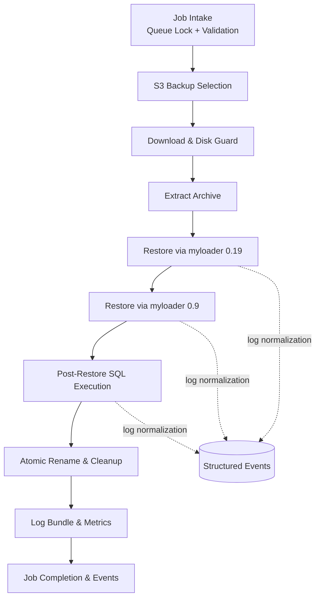

# Appalachian Workflow Lessons and Worker Plan (Nov 2025)

## 1. Objectives
- Capture what worked and what failed while performing the recent S3→download→extract→restore workflow with both myloader versions.
- Define consistent templates for parsing verbose logs so progress, warnings, and hard failures can be visualized regardless of loader version.
- Translate the hands-on run into a prescriptive worker agent plan that manages a queued restore job end-to-end without ad-hoc shell work.

## 2. Lessons Learned Across the Workflow
### 2.1 S3 Listing and Download
- **Fail fast on listing gaps**: Always validate that the chosen prefix (`daily/stg/appalachian/...tar`) produces entries with both the `.tar` and the expected `manifest.json`. Missing artifacts should abort selection before any download.
- **Capture provenance**: Record `{bucket, key, size, last_modified}` in the job metadata before download. It prevents “which file did we grab?” confusion when multiple runs overlap.
- **Size-aware download**: Backup archives for medium customers still approach 1–2 GB. Track both compressed size and projected expanded footprint (×1.8) to ensure disk guardrails match what the downloader already enforces.

### 2.2 Extraction
- **Deterministic paths**: Expand into `pulldb/binaries/<customer>/<timestamp>/` so re-runs do not clobber prior investigations.
- **Checksum verification**: `tar -xf` succeeded, but we should integrate sha256 verification after download to catch truncated transfers.
- **Tmp hygiene**: Extraction should register the directory with the cleanup manager once downstream stages finish.

### 2.3 Modern Restore (myloader 0.19)
- **Thread reporting**: Log lines include `S-Thread ##` plus table names, which provide natural progress checkpoints (every metadata chunk). Persisting those lines lets observers understand which tables remain.
- **Spurious warnings**: The `Unknown database 'system'` warning is benign but should be normalized into a known warning bucket so it does not page humans.
- **Session setup noise**: Hundreds of `Executing set session` lines represent state prep; they should be collapsed in visual output (e.g., single counter) to avoid flooding dashboards.

### 2.4 Legacy Restore (myloader 0.9)
- **SQL mode sensitivity**: Errors such as `Invalid default value` required dropping `STRICT_TRANS_TABLES`. Worker should snapshot current `sql_mode`, downgrade when running legacy tooling, and restore afterward.
- **Idempotent drops**: Each table creation is preceded by `Dropping table or view`. On failure, these log pairs indicate exactly where the process stopped, which is ideal for resumable workflows.

## 3. Log Interpretation Templates
### 3.1 Normalization Layer
- **Input**: Raw log line, tool (`myloader`), version (`0.9|0.19`), timestamp.
- **Regex extraction**:
  - Timestamp: `\*\* (?:Message|WARNING): (?P<time>\d{2}:\d{2}:\d{2}\.\d{3})`
  - Thread: `Thread (?P<thread>\d+)`
  - Table: ``\`(?P<schema>[\w]+)\`\.\`(?P<table>[^`]+)\``
  - Progress: `\[ (?P<pct>\d+)% \] | Tables: (?P<remaining>\d+)/(\d+)`
  - Warning/Error: `WARNING|ERROR|CRITICAL` tokens.
- **Normalized event payload**:
  ```json
  {
    "ts": "2025-11-19T17:27:50.761Z",
    "tool": "myloader",
    "version": "0.19",
    "thread": 17,
    "phase": "table-import",
    "object": "actiontermiteaz_local.mobileUserSettings",
    "progress": {"table_pct": 0, "tables_remaining": 496},
    "severity": "info",
    "raw": "** Message: ..."
  }
  ```
- **Aggregation strategy**: Stream events into a ring buffer (per stage) plus a metrics emitter (counts, durations). Maintain caches for “last event per thread” to render condensed UI updates.

### 3.2 Progress Template — myloader (0.9 & 0.19)
| Field | 0.9 | 0.19 | Display Guidance |
| --- | --- | --- | --- |
| Thread Started | `8 threads created` + `Thread #` lines | `S-Thread ##: Starting import` | Show total threads + per-thread state. |
| Table Lifecycle | Paired `Dropping` / `Creating` / `Inserting` lines | `Thread ## working on table` | Collapse repetitive drop/create pairs into a single progress update per table. |
| Index Build | Not explicit | `Fast index creation will be use` | Log as milestone for large tables. |
| Completion | `Finished restore at` or absence -> need `Queue done` | Need to watch FIFO cleanup + summary line | Worker should cross-check DB metadata before exiting stage. |

### 3.3 Error Template
| Category | Detection Pattern | Stop Logic | Visual Output |
| --- | --- | --- | --- |
| Missing dependency | `error while loading shared libraries` | Abort immediately; emit remediation hint (install package) | Red banner + actionable command. |
| SQL mode violation | `ERROR 1366 Invalid default value` | Pause, apply sql_mode override, retry once (config-driven) | Warning icon + “auto-retied with sql_mode=NO_ENGINE_SUBSTITUTION”. |
| Permissions | `Access denied for user` / `S3 AccessDenied` | Abort; worker should escalate with runbook link | Critical card with bucket/ARN details. |
| Data corruption | `CRC`/`checksum mismatch` or `tar` exit non-zero | Abort, mark artifact “quarantined” | Mark job as `failed-corrupt` and link log extract. |
| Unexpected | Anything not matched | Fail hard, escalate to human review | Provide raw snippet + suggestion to attach logs. |

## 4. Visual Issue & Stop Logic Strategy
1. **Live progress view**: Render per-stage progress (Download, Extract, Restore Modern, Restore Legacy, Post-SQL, Metrics publish). Each stage subscribes to normalized events.
2. **Stop triggers**:
   - Download: `bytes_transferred < expected` after retry budget.
   - Extract: Non-zero tar exit or checksum mismatch.
   - Restore/Dump: Detection of `ERROR`, `CRITICAL`, or absence of progress for configurable duration (e.g., 5 minutes) -> treat as hang.
3. **Warnings bucket**: Known benign warnings (missing `system` schema, `(null)` column introspection) stored separately to keep main feed green but still searchable.
4. **Combined processing layer**: Feed both 0.9 and 0.19 log streams through the normalization pipeline so UI components only reason about structured events, not raw text. Template definitions ensure identical visual outputs even though text differs.
5. **Process stop logic**: Whenever severity `error` arrives, halt downstream stages, persist fail reason, and attach last 200 log lines plus normalized event summary to the job record.

## 5. Worker Agent Execution Plan
### 5.1 High-Level Flow
1. **Job Intake**
   - Poll queue, lock job, emit `job-started` event.
   - Verify CLI inputs already validated (user_code, target, overwrite flag). Ensure runbook link stored in job notes.
2. **S3 Selection**
   - List candidate backups (staging bucket first). Apply filters (customer, date, format). Store chosen `{bucket, key, checksum}`.
   - If no candidate -> fail job with `missing-backup` error.
3. **Download & Verify**
   - Stream to disk with disk capacity guard (size × 1.8). Capture progress every 5% for UI.
   - After download, compute checksum; compare to S3 metadata if available.
4. **Extraction**
   - Extract tar into temp dir named `{target}_{job_id}`. Record file manifest.
   - Register cleanup hook to delete directory post job success/failure (unless flagged preserve).
5. **Restore (Modern)**
   - Run myloader 0.19 into staging DB (`target_jobid`). Collect log to structured pipeline.
   - On failure, capture log, stop job.
6. **Legacy Restore**
   - Apply SQL mode downgrade, run myloader 0.9 into `*_legacy` staging, restore sql_mode after success.
7. **Post-Restore SQL** (if required by job type)
   - Execute sanitization scripts. Record per-file success/failure.
8. **Atomic Cutover**
   - Invoke stored procedure to rename staging → target. Drop staging on success.
9. **Log Archival & Metrics**
   - Package relevant logs (download, extraction, each loader stage) into `.tar.gz`, upload to artifact bucket or attach to job record.
10. **Job Completion**
   - Update job status to `complete` with summary (backup, durations, warnings). Emit metrics (total runtime, data size, warnings count).

### 5.2 Control Guards
- **Idempotent cleanup**: On any failure, leave staging DB intact for diagnostics but drop temp directories only after copying logs.
- **Retry policy**: Only deterministic issues (sql_mode, dependency install) get automated retries; others fail immediately to honor FAIL HARD.
- **Progress heartbeat**: Worker emits heartbeat every 60s summarizing current stage, latest table, percent. If heartbeat missing for 3 intervals, orchestrator assumes stall and surfaces alert.
- **Template updates**: New warning/error patterns are added to the normalization dictionary with version tags so future runs auto-classify them.

## 6. Next Actions
1. Implement log normalization module shared by CLI/worker (Python dataclasses + regex library).
2. Wire worker service to stream subprocess stdout/stderr through the normalizer, emitting structured events to logging + metrics sinks.
3. Update restore orchestration tests to cover new stop-logic cases (checksum mismatch, sql_mode retry, missing dependency detection).
4. Extend documentation (`runbook-restore.md`) with references to this plan so humans can trace each automation stage.

### 6.1 Configurable myloader Surface
To keep future restores tweakable without code edits, the worker iteration introduces explicit knobs that live in the environment/Settings table and flow into the `MyLoaderSpec` builder. Defaults keep the current behavior when no overrides are set.

| Setting | Source | Default | Purpose |
| --- | --- | --- | --- |
| `PULLDB_MYLOADER_BINARY` | Env → Settings | `myloader` | Replace binary path when testing patched or legacy builds. |
| `PULLDB_MYLOADER_EXTRA_ARGS` | Env → Settings | _empty_ | Append CLI flags (e.g., `--rows-per-insert=1000`) without touching code. |
| `PULLDB_MYLOADER_TIMEOUT_SECONDS` | Env → Settings | `7200` | Upper-bound each restore stage so hung processes trip FAIL HARD alarms. |
| `PULLDB_MYLOADER_THREADS` | Env → Settings | `8` | Cap concurrency for hosts with fewer cores or slower I/O. |

Implementation plan:
- Extend `pulldb.domain.config.Config` to surface the new fields, preserving two-phase loading (env bootstrap, MySQL enrichment).
- Update `pulldb.domain.restore_models.MyLoaderSpec` helpers so the worker always consumes the configurable values when constructing subprocess arguments.
- Add pytest coverage for both default and override paths to prove the worker reads external configuration before launching myloader.
- Provide a `pulldb.worker.restore.build_restore_workflow_spec` helper so worker orchestration always sources timeout/binary/thread values from the Config without duplicating glue code.

## 7. Summary & Visuals
### 7.1 Stage Checklist (Runbook Snapshot)
- **Job Intake** → lock + validate job metadata, emit `job-started`.
- **S3 Selection** → pick `{bucket, key, checksum}`; fail hard if none qualify.
- **Download & Verify** → stream with capacity guard, checksum on completion.
- **Extraction** → deterministic temp dir, register cleanup + manifest capture.
- **Restore 0.19** → load into staging DB, normalize logs, halt on errors.
- **Restore 0.9** → downgrade `sql_mode`, load compatibility target, restore settings.
- **Post-Restore SQL** → execute sanitization scripts sequentially with per-file status.
- **Atomic Cutover** → call stored procedure, drop staging when rename succeeds.
- **Logs & Metrics** → bundle logs, emit metrics heartbeat/summaries.
- **Job Completion** → update status + job events, surface warnings list.

### 7.2 Flow Diagram

