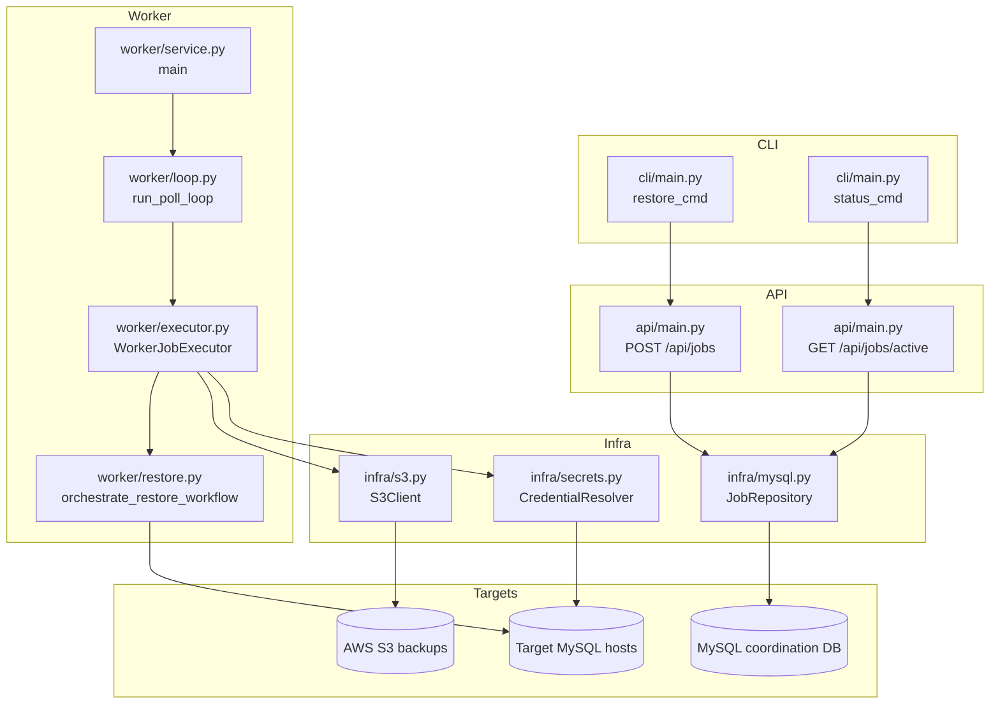
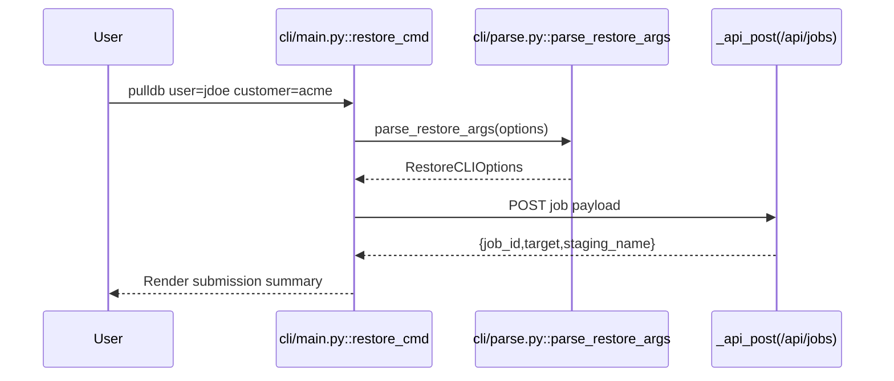
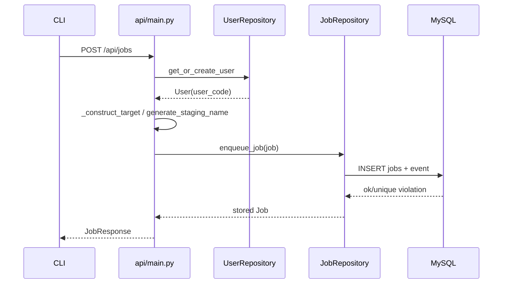
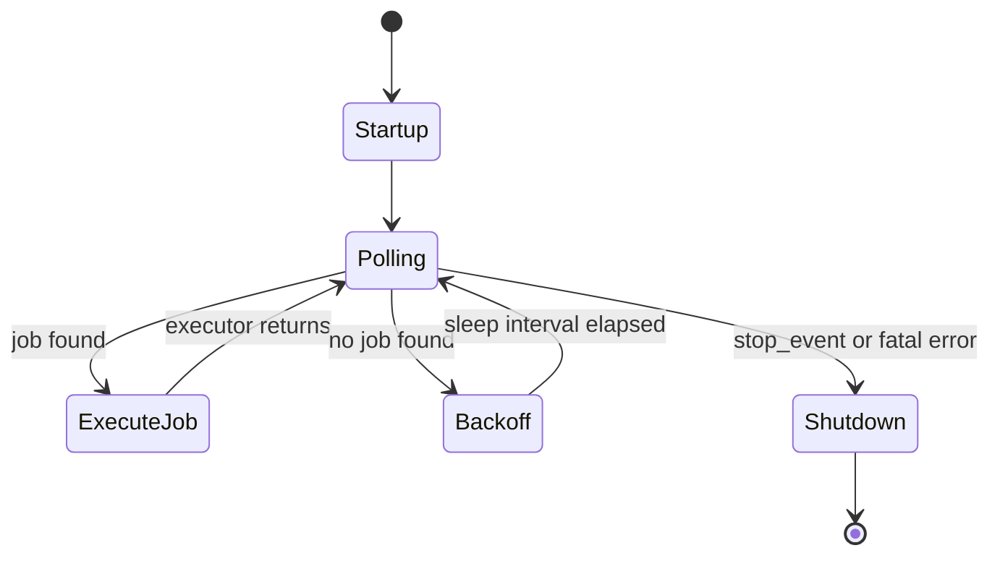
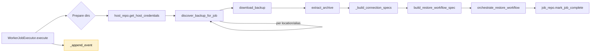
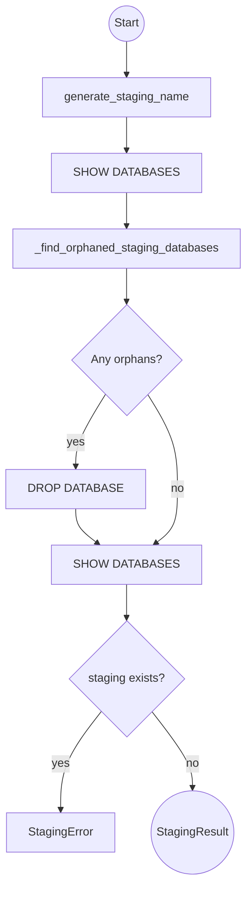
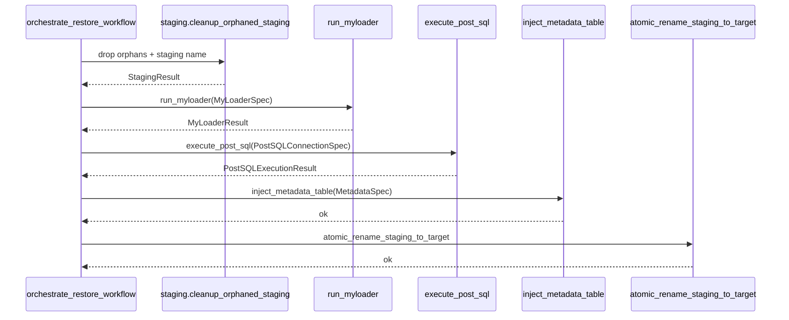

# pullDB Program Flow Workbook

_Date:_ 2025-11-21  
_Repo:_ `pullDB` (branch `main`)  
_Scope:_ Complete logical flow of the Python package under `pulldb/`, diagrammed from top-level orchestration down to per-function responsibilities.

---

## Layer 0 – End-to-End System Overview
- CLI (`pulldb/cli/main.py`) validates user input then relays REST calls to the API service.
- FastAPI service (`pulldb/api/main.py`) persists jobs via MySQL repositories and returns job metadata.
- Worker daemon (`pulldb/worker/service.py`) polls the queue, executes restores, and updates job state.
- AWS S3 provides backups, while target MySQL hosts receive staging + atomic rename operations.

---

## Layer 1 – CLI Program Flow (`pulldb/cli/*.py`)
### Restore Command Path
1. `restore_cmd` enforces `--limit`, gathers tokens, and calls `parse_restore_args`.
2. `parse_restore_args` (in `cli/parse.py`) sanitizes username/customer tokens and enforces mutually exclusive `customer` vs `qatemplate` semantics.
3. Validated options become a payload passed to `_api_post` (requests POST) targeting `/api/jobs`.
4. Responses are echoed to stdout with guardrails for missing fields.

### Status Command Path
- `status_cmd` enforces `--limit`, issues `_api_get(/api/jobs/active)`, and formats rows via `_job_row_from_payload`.
- JSON mode streams API payload verbatim; table mode formats timestamps with `_parse_iso` helper.

### Key CLI Utilities
| File | Functions/Classes | Purpose |
| --- | --- | --- |
| `cli/parse.py` | `parse_restore_args`, `RestoreCLIOptions`, `_tokenize` | Token validation, user_code derivation, target-length guardrail. |
| `cli/main.py` | `_api_post`, `_api_get`, `_load_api_config`, `_job_row_from_payload` | HTTP transport, structured response parsing, CLI surface. |

---

## Layer 2 – API Service Flow (`pulldb/api/main.py`)
### State Initialization
- `get_api_state` lazily calls `_initialize_state`, which loads `Config.minimal_from_env`, builds a MySQL pool, and wires repositories.

### Job Submission (`POST /api/jobs`)
1. FastAPI injects `APIState`; `_validate_job_request` enforces customer/template exclusivity.
2. `_enqueue_job` composes `Job` dataclass with target computed via `_construct_target` and staging derived from `generate_staging_name`.
3. `JobRepository.enqueue_job` persists the job; conflicts raise HTTP 409.
4. Metrics: `jobs_enqueued_total` counter + `job_enqueue_conflict` events.

### Active Jobs (`GET /api/jobs/active`)
- `_active_jobs` queries `JobRepository.get_active_jobs`, hydrates staging names, and returns `JobSummary` models.

---

## Layer 3 – Worker Lifecycle (`pulldb/worker/service.py`, `loop.py`)
### Daemon Startup
- `service.main` parses `--max-iterations`, loads `Config`, builds `JobRepository` and `WorkerJobExecutor`, registers signal handlers, and records lifecycle metrics.

### Polling Loop
- `run_poll_loop` (loop.py) repeatedly:
  1. Calls `job_repo.get_next_queued_job()` within `time_operation` metric wrapper.
  2. If a job exists, `mark_job_running` + `append_job_event("running")` then invokes executor.
  3. On empty queue, backs off exponentially up to 30 seconds while emitting `queue_empty` events.

---

## Layer 4 – Worker Job Executor Pipeline (`pulldb/worker/executor.py`)

- Discovery uses configured `S3BackupLocationConfig` list; fallbacks derive from `Config.s3_bucket_path`.
- `download_backup` guarantees disk capacity via `ensure_disk_capacity` before streaming data.
- `_build_connection_specs` returns staging + post-SQL connection dataclasses powered by resolved Secrets Manager credentials.

---

## Layer 5 – Restore Workflow Internals (`pulldb/worker/restore.py` & peers)
### 5.1 Staging Lifecycle (`worker/staging.py`)
- `cleanup_orphaned_staging` → `generate_staging_name` → drop `{target}_[0-9a-f]{12}` databases via MySQL cursor.
- Validates the staging name no longer exists post cleanup; raises `StagingError` if collisions persist.

### 5.2 Myloader Execution (`worker/restore.py` + `domain/restore_models.py`)
- `build_restore_workflow_spec` wraps `build_configured_myloader_spec`, merging global `Config.myloader_*` overrides with job-specific arguments.
- `run_myloader` executes `_build_command`, delegates to `infra.exec.run_command`, and translates non-zero exits to `MyLoaderError` with captured stdout/stderr tails.

### 5.3 Post-Restore SQL (`worker/post_sql.py`)
- `execute_post_sql` discovers `*.sql` scripts under `customers_after_sql/` or `qa_template_after_sql/`, executes sequentially using autocommit, and stops on first failure by raising `PostSQLError`.

### 5.4 Metadata Injection (`worker/metadata.py`)
- `inject_metadata_table` ensures a fixed `pullDB` table exists, composes JSON summary of script runs, and inserts a record keyed by `job_id`.

### 5.5 Atomic Rename (`worker/atomic_rename.py`)
- `atomic_rename_staging_to_target` validates stored procedure `pulldb_atomic_rename` exists (`_verify_procedure_exists`) then calls it; failures raise `AtomicRenameError` preserving staging DB for inspection.

---

## Layer 6 – Supporting Infrastructure
### MySQL Repositories (`pulldb/infra/mysql.py`)
- `JobRepository`: queue CRUD (`enqueue_job`, `get_next_queued_job`, `mark_job_*`, `append_job_event`).
- `UserRepository`: `get_or_create_user` with collision-aware `generate_user_code`.
- `HostRepository`: resolves `MySQLCredentials` via `CredentialResolver` and enforces host capacity.
- `SettingsRepository`: surfaces DB-stored configuration for `Config.from_env_and_mysql`.

### AWS & Config Glue
| Module | Key Functions | Role |
| --- | --- | --- |
| `domain/config.py` | `Config.minimal_from_env`, `from_env_and_mysql`, `_resolve_parameter`, `_load_s3_backup_locations` | Two-phase configuration load w/ SSM + Secrets integration. |
| `infra/secrets.py` | `CredentialResolver.resolve`, `_resolve_from_secrets_manager`, `_resolve_from_ssm` | Fetch credentials for coordination + target hosts. |
| `infra/s3.py` | `S3Client`, `discover_latest_backup`, `parse_s3_bucket_path` | Backup discovery + metadata for disk planning. |
| `infra/exec.py` | `run_command`, `CommandResult`, `CommandTimeoutError` | Deterministic subprocess execution wrappers. |
| `infra/logging.py` & `infra/metrics.py` | `get_logger`, `emit_counter/gauge/timer/event`, `time_operation` | Structured JSON logging + log-based metrics channel. |

---

## Layer 7 – Module Atlas (File-by-File Reference)
| Path | Key Symbols | Responsibility | Upstream Callers |
| --- | --- | --- | --- |
| `pulldb/__init__.py` | `__version__` | Package metadata for CLI/API version banners. | Imported by CLI and packaging.
| `pulldb/api/main.py` | `app`, `JobRequest`, `submit_job`, `list_active_jobs` | FastAPI surface for job submission/status. | CLI, future UI calls.
| `pulldb/cli/main.py` | `cli`, `restore_cmd`, `status_cmd`, `_api_post/_api_get` | User-facing CLI with REST bridge. | End users.
| `pulldb/cli/parse.py` | `parse_restore_args`, `RestoreCLIOptions` | Strict token parsing + target length enforcement. | `restore_cmd`.
| `pulldb/domain/config.py` | `Config`, `S3BackupLocationConfig` | Central configuration + AWS parameter resolution. | API, worker, tests.
| `pulldb/domain/errors.py` | `JobExecutionError` hierarchy | FAIL HARD diagnostics (DownloadError, DiskCapacityError, etc.). | Worker downloader/restore modules.
| `pulldb/domain/models.py` | `JobStatus`, `Job`, `User`, etc. | Immutable domain entities mirroring MySQL schema. | API, worker, repositories.
| `pulldb/domain/restore_models.py` | `MyLoaderSpec`, `MyLoaderResult`, `build_configured_myloader_spec` | Typed contracts for myloader subprocess. | `restore.py`, tests.
| `pulldb/infra/exec.py` | `run_command`, `CommandResult` | Safe subprocess execution w/ timeout + truncation. | `worker/restore.py`.
| `pulldb/infra/logging.py` | `JSONFormatter`, `get_logger` | Consistent JSON logging surface. | All modules.
| `pulldb/infra/metrics.py` | `emit_counter/gauge/timer/event`, `time_operation` | Log-based metrics instrumentation. | Worker loop + restore.
| `pulldb/infra/mysql.py` | `MySQLPool`, `JobRepository`, `UserRepository`, `HostRepository`, `SettingsRepository` | Persistence layer for queue/users/hosts/settings. | API + worker service.
| `pulldb/infra/s3.py` | `S3Client`, `discover_latest_backup`, `BackupSpec` | S3 listing/head helpers for newest backup selection. | `worker/executor.py`.
| `pulldb/infra/secrets.py` | `CredentialResolver`, `MySQLCredentials` | AWS Secrets/SSM credential lookup. | `Config`, `HostRepository`, worker.
| `pulldb/worker/service.py` | `main`, `_parse_args` | Worker daemon bootstrap + signal handling. | Systemd/service entrypoint.
| `pulldb/worker/loop.py` | `run_poll_loop` | Queue polling + exponential backoff. | Worker service. |
| `pulldb/worker/executor.py` | `WorkerJobExecutor`, `discover_backup_for_job`, `extract_tar_archive` | Orchestrates per-job download + restore + completion. | Poll loop.
| `pulldb/worker/downloader.py` | `ensure_disk_capacity`, `download_backup` | S3 streaming download with preflight guard. | Worker executor.
| `pulldb/worker/restore.py` | `build_restore_workflow_spec`, `run_myloader`, `orchestrate_restore_workflow` | Core restore pipeline (staging → rename). | Worker executor.
| `pulldb/worker/staging.py` | `generate_staging_name`, `cleanup_orphaned_staging` | Staging lifecycle + orphan cleanup. | Restore workflow, API staging previews.
| `pulldb/worker/post_sql.py` | `execute_post_sql`, `PostSQLExecutionResult` | Post-restore SQL runner for sanitization scripts. | Restore workflow.
| `pulldb/worker/metadata.py` | `inject_metadata_table`, `MetadataSpec` | Injects audit metadata into staging DB. | Restore workflow.
| `pulldb/worker/atomic_rename.py` | `atomic_rename_staging_to_target`, `AtomicRenameSpec` | Stored procedure invocation for staging→target swap. | Restore workflow.
| `pulldb/worker/log_normalizer.py` | `normalize_myloader_line`, `NormalizedLogEvent` | Optional parser for myloader stdout to structured events. | Future log processors/tests.
| `pulldb/api/__init__.py`, `pulldb/cli/__init__.py`, `pulldb/infra/__init__.py`, `pulldb/worker/__init__.py` | package markers | Maintain package structure, expose public symbols. | Imports across repo.

---

### Usage Notes
- Re-run worker diagrams after modifying `worker/restore.py` to ensure every new phase is documented here.
- Extend the Module Atlas table whenever new Python files land under `pulldb/` to keep "smallest atom" coverage intact.
