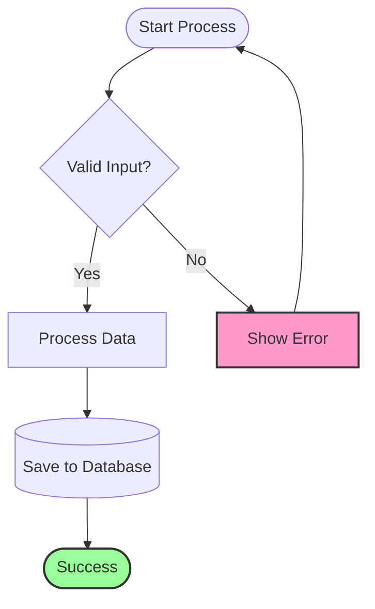
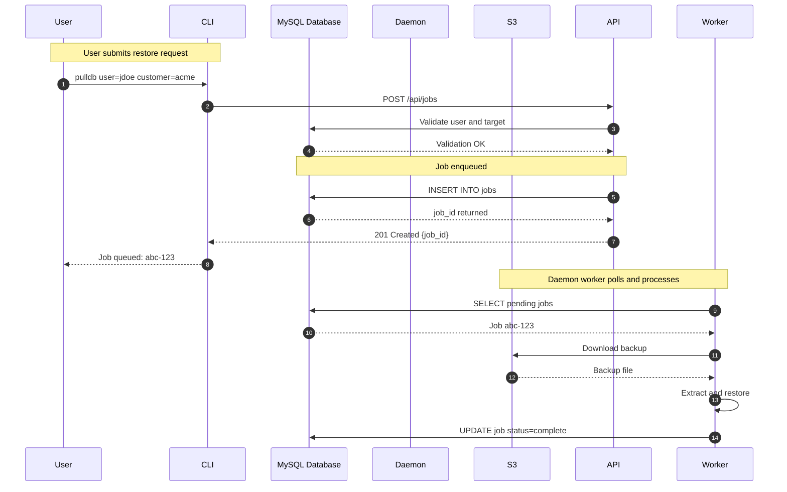
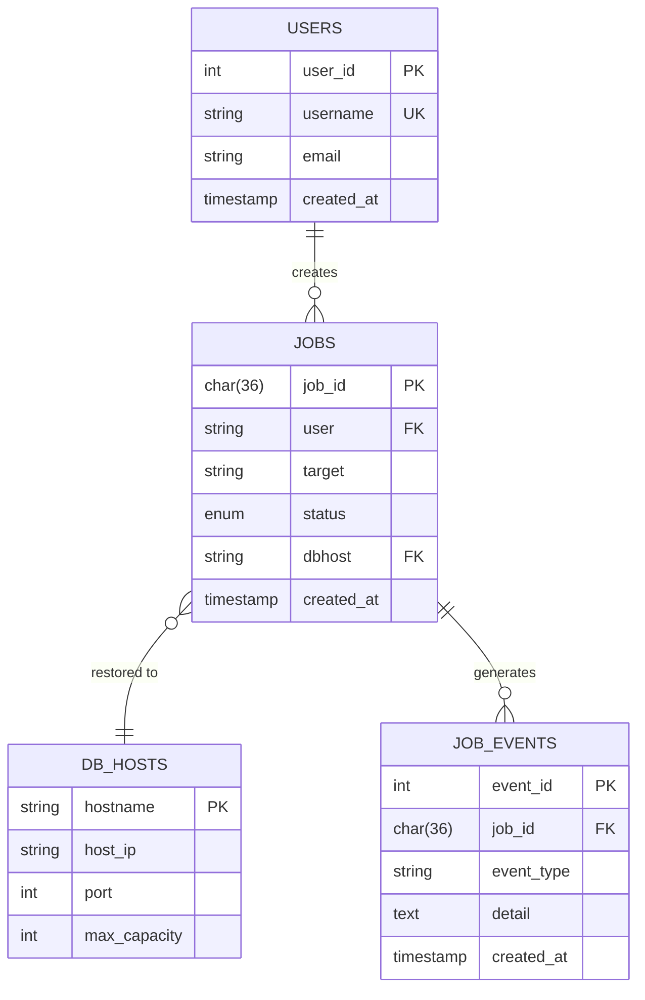
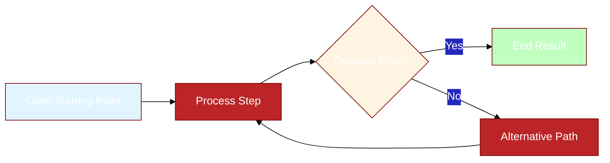

# Comprehensive Coding Standards

This document provides detailed coding standards for all file types used in the pullDB project. These standards are based on industry best practices and community-accepted style guides.

**Quick Reference**:
- Python: [PEP 8](https://peps.python.org/pep-0008/), [PEP 484](https://peps.python.org/pep-0484/) (Type Hints)
- Markdown: CommonMark, GitHub Flavored Markdown
- SQL: SQL Style Guide (Simon Holywell)
- Shell Scripts: Google Shell Style Guide
- YAML: YAML Best Practices
- Mermaid: Mermaid Diagram Standards

## Table of Contents

1. [Python Standards](#python-standards)
2. [Markdown Standards](#markdown-standards)
3. [SQL Standards](#sql-standards)
4. [Shell Script Standards](#shell-script-standards)
5. [YAML Standards](#yaml-standards)
6. [Mermaid Diagram Standards](#mermaid-diagram-standards)
7. [Documentation Standards](#documentation-standards)

---

## Python Standards

### Linter and Formatter: Ruff

**Primary Tool**: [Ruff](https://docs.astral.sh/ruff/) - An extremely fast Python linter and formatter, written in Rust. Ruff replaces multiple tools (Flake8, isort, pydocstyle, pyupgrade, etc.) with a single, comprehensive tool.

**Key Features**:
- **Speed**: 10-100x faster than traditional linters
- **Comprehensive**: Implements 500+ rules from Flake8, isort, pydocstyle, pyupgrade, and more
- **Drop-in Replacement**: Compatible with existing configurations
- **Auto-fix**: Automatically fixes many issues (imports, formatting, etc.)
- **VS Code Integration**: Real-time diagnostics in editor

**Configuration** (in `pyproject.toml`):
```toml
[tool.ruff]
line-length = 88
target-version = "py311"

[tool.ruff.lint]
select = [
    "E",   # pycodestyle errors
    "W",   # pycodestyle warnings
    "F",   # pyflakes
    "I",   # isort
    "N",   # pep8-naming
    "D",   # pydocstyle
    "UP",  # pyupgrade
    "B",   # flake8-bugbear
    "C4",  # flake8-comprehensions
    "SIM", # flake8-simplify
]
ignore = [
    "D203",  # one-blank-line-before-class (conflicts with D211)
    "D213",  # multi-line-summary-second-line (conflicts with D212)
]

[tool.ruff.lint.pydocstyle]
convention = "google"

[tool.ruff.lint.per-file-ignores]
"tests/**/*.py" = ["D100", "D103"]  # Allow missing docstrings in tests
```

**Common Ruff Rules**:
- **D101**: Missing docstring in public class
- **D102**: Missing docstring in public method
- **D103**: Missing docstring in public function
- **E501**: Line too long (> 88 characters)
- **F401**: Imported but unused
- **F841**: Local variable assigned but never used
- **I001**: Import block is un-sorted or un-formatted
- **N802**: Function name should be lowercase
- **N806**: Variable in function should be lowercase
- **B904**: Within an except clause, raise exceptions with `raise ... from err`

**Usage Commands**:
```bash
# Check all files
ruff check .

# Check with fixes applied
ruff check --fix .

# Format code (Black-compatible)
ruff format .

# Check specific file
ruff check pulldb/domain/config.py

# Show rule documentation
ruff rule D101
```

**VS Code Integration**:
Install the Ruff extension (`charliermarsh.ruff`) for real-time diagnostics:
```json
{
  "ruff.enable": true,
  "ruff.lint.run": "onType",
  "ruff.format.enable": true,
  "[python]": {
    "editor.defaultFormatter": "charliermarsh.ruff",
    "editor.formatOnSave": true,
    "editor.codeActionsOnSave": {
      "source.fixAll.ruff": true,
      "source.organizeImports.ruff": true
    }
  }
}
```

### Base Standard: PEP 8

All Python code must follow [PEP 8 - Style Guide for Python Code](https://peps.python.org/pep-0008/).

### Line Length and Formatting

```python
# Maximum line length: 88 characters (Black formatter default)
# Use 4 spaces for indentation (never tabs)
# Two blank lines between top-level definitions
# One blank line between methods in a class

from __future__ import annotations

import os
from pathlib import Path


def top_level_function() -> None:
    """First function."""
    pass


def another_function() -> None:
    """Second function."""
    pass
```

### Type Hints (PEP 484, PEP 526)

**Required for all function signatures:**

```python
from typing import Any
from collections.abc import Sequence


def process_data(
    items: list[str],
    limit: int | None = None,
    *,
    verbose: bool = False,
) -> dict[str, int]:
    """Process items with optional limit.

    Args:
        items: List of items to process
        limit: Maximum number of items (None = unlimited)
        verbose: Enable verbose output

    Returns:
        Dictionary mapping items to counts

    Raises:
        ValueError: If items list is empty
    """
    if not items:
        raise ValueError("Items list cannot be empty")
    return {}
```

### Docstrings (Google Style)

**Required for all public modules, classes, functions, and methods:**

```python
"""Module-level docstring.

This module provides functionality for X, Y, and Z.
More detailed explanation can go here.
"""


class ExampleClass:
    """Brief description of the class.

    More detailed description of the class purpose and usage.

    Attributes:
        attribute_name: Description of the attribute
        another_attr: Description of another attribute
    """

    def method(self, arg: str) -> bool:
        """Brief description of method.

        Longer description if needed.

        Args:
            arg: Description of argument

        Returns:
            Description of return value

        Raises:
            TypeError: Description of when raised
            ValueError: Description of when raised
        """
        return True
```

### Import Organization

```python
"""Module docstring goes first."""
from __future__ import annotations  # Always first import

# Standard library imports (alphabetized)
import os
import sys
from dataclasses import dataclass
from pathlib import Path
from typing import Any

# Third-party imports (alphabetized)
import boto3
import click
from mysql.connector import Error as MySQLError

# Local imports (alphabetized)
from pulldb.domain import Config, Job
from pulldb.infra.mysql import MySQLConnection
```

### Naming Conventions

```python
# Modules: lowercase_with_underscores.py
# packages/: lowercase_with_underscores/

# Classes: CapitalizedWords (PascalCase)
class DatabaseConnection:
    pass

# Functions and methods: lowercase_with_underscores
def calculate_total(items: list[int]) -> int:
    pass

# Constants: UPPER_CASE_WITH_UNDERSCORES
MAX_RETRY_COUNT = 3
DEFAULT_TIMEOUT = 30

# Variables: lowercase_with_underscores
user_count = 0
total_amount = 100.50

# Private (internal use): prefix with single underscore
_internal_helper()
_private_attribute = "value"

# Protected (subclass use): prefix with single underscore
def _protected_method(self) -> None:
    pass

# Name mangling (rare): prefix with double underscore
__private_class_attribute = "value"
```

### Error Handling

```python
# Always preserve traceback with 'from e'
try:
    risky_operation()
except SpecificError as e:
    raise ValueError(f"Context about failure: {e}") from e

# Use specific exception types
try:
    value = int(user_input)
except ValueError as e:
    logger.error("Invalid input: %s", e)
    raise

# Don't use bare except
# BAD:
try:
    operation()
except:  # Never do this!
    pass

# GOOD:
try:
    operation()
except Exception as e:  # Catch broad exception explicitly
    logger.exception("Operation failed: %s", e)
    raise
```

### Logging (Never print())

```python
import logging

logger = logging.getLogger(__name__)

# Use appropriate log levels
logger.debug("Detailed diagnostic information")
logger.info("General informational messages")
logger.warning("Warning messages for unexpected situations")
logger.error("Error messages for failures")
logger.critical("Critical failures requiring immediate attention")

# Include context in log messages
logger.info(
    "Processing job",
    extra={
        "job_id": job.id,
        "target": job.target,
        "user": job.user,
    }
)
```

---

## Markdown Standards

### Base Standard: CommonMark + GitHub Flavored Markdown

Follow [CommonMark](https://commonmark.org/) specification with [GitHub Flavored Markdown (GFM)](https://github.github.com/gfm/) extensions.

### Document Structure

```markdown
# Document Title (H1 - only one per document)

Brief description of document purpose in first paragraph.

## Main Section (H2)

Content for main section.

### Subsection (H3)

More detailed content.

#### Sub-subsection (H4)

Even more specific content.

## Another Main Section

Continue with logical sections.
```

### Headings

- Use ATX-style headings (`#`) not Setext-style (`===` or `---`)
- One space after `#` symbols
- No trailing `#` symbols
- One blank line before and after headings
- One H1 per document (document title)
- Hierarchical: don't skip levels (H1 → H2 → H3, not H1 → H3)

```markdown
# Correct Heading

## Subsection

### Sub-subsection

Content here.
```

### Lists

**Unordered lists:**
```markdown
- Use hyphens for unordered lists
- Consistent indentation (2 spaces per level)
  - Nested item
  - Another nested item
- Back to top level
```

**Ordered lists:**
```markdown
1. First item
2. Second item
3. Third item
   - Can mix with unordered
   - Like this
4. Fourth item
```

**Task lists (GFM):**
```markdown
- [ ] Uncompleted task
- [x] Completed task
- [ ] Another task
```

### Code Blocks

**Inline code:**
```markdown
Use `backticks` for inline code, commands, or `variable_names`.
```

**Fenced code blocks:**
````markdown
```python
def example_function() -> None:
    """Always specify language for syntax highlighting."""
    print("Hello, World!")
```

```bash
# Shell commands
echo "Use bash, sh, or console for shell"
```

```sql
-- SQL examples
SELECT * FROM users WHERE active = 1;
```
````

### Links and References

```markdown
<!-- Inline links -->
[Link text](https://example.com)

<!-- Reference-style links (better for maintenance) -->
See the [Python documentation][python-docs] for details.

[python-docs]: https://docs.python.org/3/

<!-- Links to headings in same document -->
See [Installation](#installation) section below.

<!-- Links to other documents -->
See [AWS Authentication Setup Guide](aws-authentication-setup.md) for configuration.
```

### Tables

```markdown
| Column 1 | Column 2 | Column 3 |
|----------|----------|----------|
| Data 1   | Data 2   | Data 3   |
| More     | Data     | Here     |

<!-- Alignment -->
| Left | Center | Right |
|:-----|:------:|------:|
| A    | B      | C     |
```

### Emphasis

```markdown
**Bold text** for strong emphasis
*Italic text* for emphasis
~~Strikethrough~~ for deleted text
`Code` for technical terms
```

### Line Length

- Aim for 80 characters per line (soft limit)
- 100 characters maximum (hard limit)
- Exception: tables, code blocks, long URLs

### Best Practices

```markdown
<!-- Use reference-style links for repeated URLs -->
Good: [Python][py-docs] and [Python tutorial][py-docs]
[py-docs]: https://docs.python.org

<!-- Add blank line before/after lists -->
This is a paragraph.

- List item 1
- List item 2

Another paragraph.

<!-- Use descriptive link text -->
Bad: Click [here](url) for documentation
Good: See the [installation guide](url) for setup instructions

<!-- Add alt text to images -->

```

---

## SQL Standards

### Base Standard: SQL Style Guide (Simon Holywell)

Follow the [SQL Style Guide](https://www.sqlstyle.guide/) with MySQL-specific adaptations.

### Keywords and Names

```sql
-- Keywords: UPPERCASE
-- Identifiers: lowercase_with_underscores
-- Always use explicit JOIN syntax

SELECT
    u.user_id,
    u.username,
    u.email,
    COUNT(o.order_id) AS order_count
FROM users AS u
INNER JOIN orders AS o
    ON u.user_id = o.user_id
WHERE u.active = 1
    AND u.created_at >= '2024-01-01'
GROUP BY
    u.user_id,
    u.username,
    u.email
HAVING COUNT(o.order_id) > 5
ORDER BY order_count DESC
LIMIT 100;
```

### Indentation and Spacing

```sql
-- Use 4 spaces for indentation
-- Align related clauses vertically
-- One clause per line for readability

SELECT
    column_one,
    column_two,
    column_three,
    CASE
        WHEN condition_one THEN 'value_one'
        WHEN condition_two THEN 'value_two'
        ELSE 'default_value'
    END AS computed_column
FROM table_name
WHERE condition = value
    AND another_condition = another_value;
```

### Table and Column Names

```sql
-- Tables: plural nouns (lowercase_with_underscores)
CREATE TABLE users (
    user_id INT AUTO_INCREMENT PRIMARY KEY,
    username VARCHAR(255) NOT NULL UNIQUE,
    email VARCHAR(255) NOT NULL,
    created_at TIMESTAMP(6) DEFAULT CURRENT_TIMESTAMP(6),
    updated_at TIMESTAMP(6) DEFAULT CURRENT_TIMESTAMP(6)
        ON UPDATE CURRENT_TIMESTAMP(6)
);

-- Junction tables: alphabetical order
CREATE TABLE user_roles (
    user_id INT NOT NULL,
    role_id INT NOT NULL,
    PRIMARY KEY (user_id, role_id),
    FOREIGN KEY (user_id) REFERENCES users(user_id),
    FOREIGN KEY (role_id) REFERENCES roles(role_id)
);
```

### Comments

```sql
-- Single-line comments use double hyphens
-- Explain WHY, not WHAT

/*
 * Multi-line comments
 * for longer explanations
 */
SELECT
    -- Fetch only active users for performance
    user_id,
    username
FROM users
WHERE active = 1;
```

### Constraints and Indexes

```sql
-- Name constraints explicitly for better error messages
CREATE TABLE jobs (
    job_id CHAR(36) PRIMARY KEY,
    target VARCHAR(64) NOT NULL,
    status ENUM('queued', 'running', 'complete', 'failed') NOT NULL,

    -- Explicit constraint names
    CONSTRAINT chk_target_length CHECK (LENGTH(target) >= 1),
    CONSTRAINT fk_jobs_dbhost FOREIGN KEY (dbhost)
        REFERENCES db_hosts(hostname)
);

-- Name indexes descriptively
CREATE INDEX idx_jobs_status_created
    ON jobs(status, created_at);

CREATE UNIQUE INDEX idx_jobs_active_target
    ON jobs(active_target_key);
```

### Migrations

```sql
-- migrations/001_create_schema.sql
-- Description: Initial schema creation
-- Date: 2025-10-30
-- Author: Engineering Team

-- Always include IF NOT EXISTS for idempotency
CREATE TABLE IF NOT EXISTS users (
    user_id INT AUTO_INCREMENT PRIMARY KEY,
    username VARCHAR(255) NOT NULL UNIQUE
);

-- Document breaking changes
-- NOTE: This migration adds NOT NULL constraint
-- Ensure existing rows have values before running
ALTER TABLE users
    MODIFY COLUMN email VARCHAR(255) NOT NULL;
```

---

## Shell Script Standards

### Base Standard: Google Shell Style Guide

Follow [Google's Shell Style Guide](https://google.github.io/styleguide/shellguide.html).

### Shebang and Header

```bash
#!/usr/bin/env bash
#
# Script name: setup-environment.sh
# Description: Sets up development environment for pullDB
# Usage: ./setup-environment.sh [options]
# Author: Engineering Team
# Date: 2025-10-30

set -euo pipefail  # Exit on error, undefined vars, pipe failures
IFS=$'\n\t'        # Safer word splitting
```

### Functions

```bash
# Use lowercase with underscores
# Declare with function keyword
# Document with comments

function check_dependencies() {
    # Check if required commands are available
    # Returns: 0 if all deps available, 1 otherwise
    local required_cmds=("mysql" "aws" "python3")

    for cmd in "${required_cmds[@]}"; do
        if ! command -v "$cmd" &> /dev/null; then
            echo "ERROR: Required command '$cmd' not found" >&2
            return 1
        fi
    done

    return 0
}
```

### Variables

```bash
# Constants: UPPERCASE
readonly MAX_RETRIES=3
readonly DEFAULT_REGION="us-east-1"

# Global variables: lowercase (minimize usage)
script_dir="$(cd "$(dirname "${BASH_SOURCE[0]}")" && pwd)"
config_file="${script_dir}/../.env"

# Local variables: always declare with 'local'
function process_file() {
    local input_file="$1"
    local output_file="$2"

    # Process files here
}
```

### Conditionals and Loops

```bash
# Use [[ ]] for conditions (not [ ])
# Quote variables
# One command per line for readability

if [[ -f "$config_file" ]]; then
    echo "Config file exists"
elif [[ -d "$config_file" ]]; then
    echo "Config is a directory"
else
    echo "Config not found"
fi

# Prefer $() over backticks for command substitution
current_date="$(date +%Y-%m-%d)"

# Array iteration
files=("file1.txt" "file2.txt" "file3.txt")
for file in "${files[@]}"; do
    echo "Processing: $file"
done
```

### Error Handling

```bash
# Exit codes
readonly EXIT_SUCCESS=0
readonly EXIT_ERROR=1
readonly EXIT_USAGE=2

function main() {
    check_dependencies || {
        echo "ERROR: Missing dependencies" >&2
        exit "$EXIT_ERROR"
    }

    # Main logic here

    exit "$EXIT_SUCCESS"
}

# Trap for cleanup
function cleanup() {
    echo "Cleaning up..."
    rm -f "$temp_file"
}
trap cleanup EXIT
```

### Usage and Help

```bash
function usage() {
    cat << EOF
Usage: ${0##*/} [OPTIONS] <required_arg>

Description of what the script does.

OPTIONS:
    -h, --help          Show this help message
    -v, --verbose       Enable verbose output
    -c, --config FILE   Use specified config file

EXAMPLES:
    ${0##*/} --config /path/to/config
    ${0##*/} -v value

EOF
}
```

---

## YAML Standards

### Base Standard: YAML Best Practices

Follow YAML 1.2 specification with Kubernetes/CI/CD conventions.

### Structure and Indentation

```yaml
# Use 2 spaces for indentation (never tabs)
# No trailing whitespace
# Explicit document start (optional but recommended)
---
# Comments start with # and single space

# Top-level keys in alphabetical order
apiVersion: v1
kind: ConfigMap
metadata:
  name: pulldb-config
  namespace: production
  labels:
    app: pulldb
    environment: prod
    version: "1.0.0"

# Use consistent indentation
data:
  # String values - quotes optional for simple strings
  database_host: "localhost"
  database_port: "3306"

  # Multi-line strings - use | for preserved newlines
  script: |
    #!/bin/bash
    echo "Line 1"
    echo "Line 2"

  # Multi-line strings - use > for folded newlines
  description: >
    This is a long description that will be
    folded into a single line with spaces
    replacing the newlines.

  # Arrays - use consistent style
  allowed_hosts:
    - dev-db-01
    - dev-db-02
    - dev-db-03

  # Inline array (only for very short lists)
  tags: [python, mysql, aws]

  # Nested structures
  aws_config:
    region: us-east-1
    profile: pr-staging
    s3:
      bucket: pestroutesrdsdbs
      prefix: daily/stg
```

### Best Practices

```yaml
---
# Use explicit typing when needed
version: "1.0"  # String, not number
port: 3306      # Number, not string

# Boolean values: use true/false (not yes/no, on/off)
enabled: true
debug: false

# Null values: use null (not ~)
optional_field: null

# Anchors and aliases for repeated content
defaults: &defaults
  timeout: 30
  retries: 3

service_a:
  <<: *defaults
  name: service-a

service_b:
  <<: *defaults
  name: service-b
  timeout: 60  # Override default

# Environment-specific configs
environments:
  development:
    database_host: localhost
    debug: true

  production:
    database_host: prod-db.example.com
    debug: false
```

---

## Mermaid Diagram Standards

### Base Standard: Mermaid Documentation

Follow [Mermaid official documentation](https://mermaid.js.org/).

### Flowcharts



### Sequence Diagrams



### Entity Relationship Diagrams



### General Best Practices



---

## Documentation Standards

### File Organization

```
docs/
  ├── README.md              # Overview and navigation
  ├── getting-started.md     # Quick start guide
  ├── architecture/          # Architecture docs
  │   ├── overview.md
  │   └── components.md
  ├── guides/                # How-to guides
  │   ├── installation.md
  │   └── configuration.md
  └── reference/             # API and reference docs
      ├── cli.md
      └── api.md
```

### Documentation Headers

```markdown
# Document Title

**Status**: Draft | Review | Approved
**Last Updated**: 2025-10-30
**Author**: Engineering Team
**Related Docs**: [Architecture](architecture.md), [API Reference](api.md)

## Overview

Brief description of document purpose and audience.

## Table of Contents

- [Section 1](#section-1)
- [Section 2](#section-2)
```

### Cross-References

```markdown
<!-- Internal links -->
See the [Installation Guide](installation.md) for setup instructions.

<!-- Section links -->
Refer to [Configuration](#configuration) section below.

<!-- External links -->
For more information, see [PEP 8](https://peps.python.org/pep-0008/).
```

### Version History

```markdown
## Version History

| Version | Date       | Author | Changes |
|---------|------------|--------|---------|
| 1.2     | 2025-10-30 | Team   | Added SQL standards |
| 1.1     | 2025-10-27 | Team   | Updated Python guidelines |
| 1.0     | 2025-10-20 | Team   | Initial version |
```

---

## Tools and Automation

### Linting and Formatting

```bash
# Python
ruff check .                    # Linting
ruff format .                   # Formatting
mypy .                          # Type checking

# Markdown
markdownlint '**/*.md'          # Markdown linting
prettier --write '**/*.md'      # Markdown formatting

# YAML
yamllint .                      # YAML linting

# SQL
sqlfluff lint migrations/       # SQL linting

# Shell scripts
shellcheck scripts/*.sh         # Shell script linting
shfmt -w scripts/*.sh          # Shell script formatting
```

### Pre-commit Integration

All standards are enforced automatically via `.pre-commit-config.yaml`.

---

## References

- [PEP 8 - Style Guide for Python Code](https://peps.python.org/pep-0008/)
- [PEP 484 - Type Hints](https://peps.python.org/pep-0484/)
- [CommonMark Spec](https://commonmark.org/)
- [GitHub Flavored Markdown](https://github.github.com/gfm/)
- [SQL Style Guide](https://www.sqlstyle.guide/)
- [Google Shell Style Guide](https://google.github.io/styleguide/shellguide.html)
- [YAML Specification](https://yaml.org/spec/1.2/spec.html)
- [Mermaid Documentation](https://mermaid.js.org/)

---

**Last Updated**: 2025-10-30
**Maintained By**: PestRoutes Engineering Team
