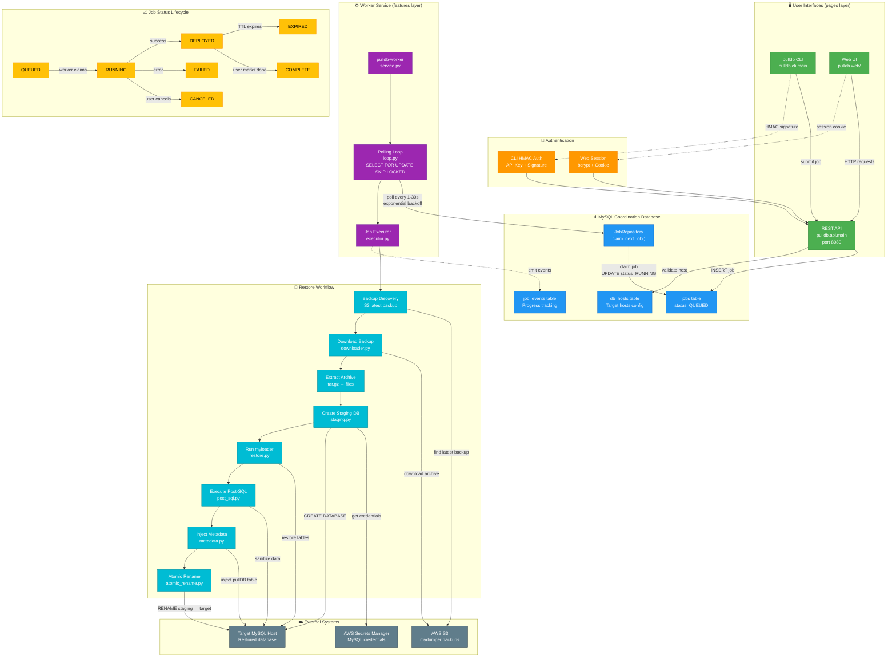
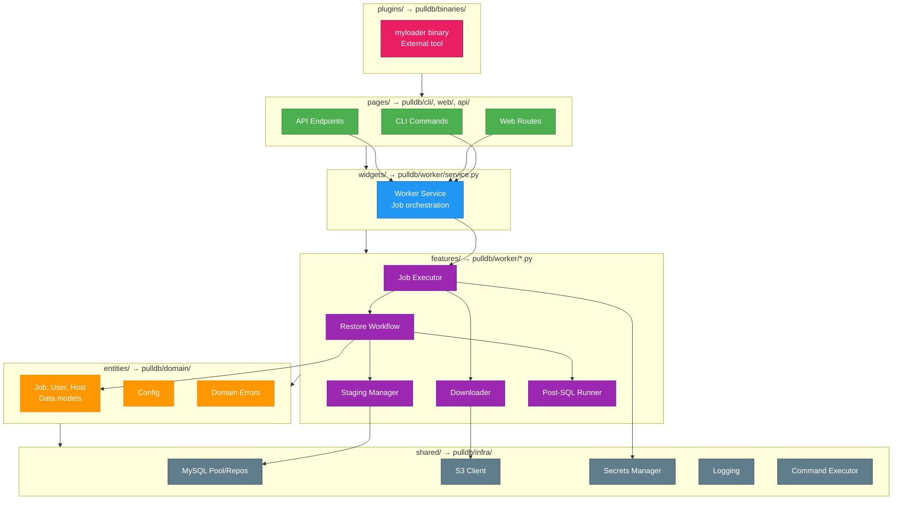
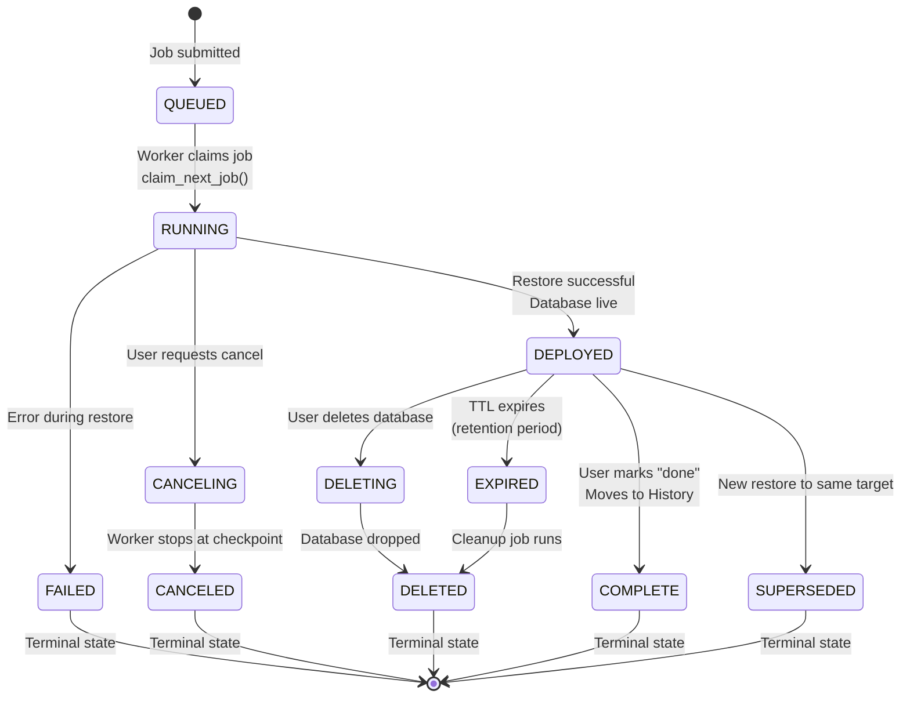
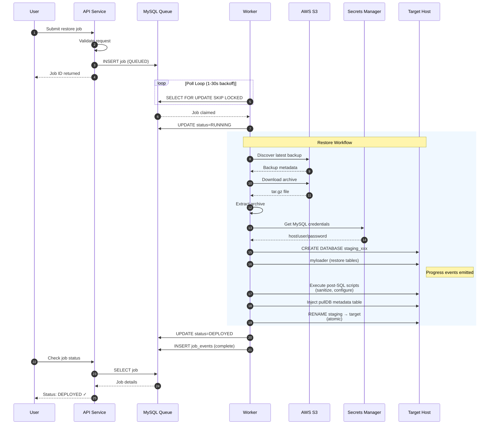
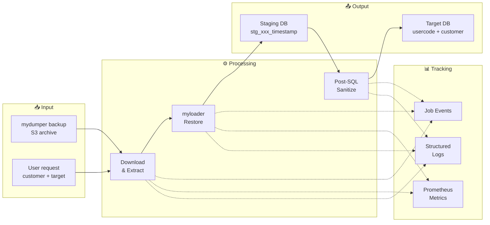

# pullDB Architecture Flowchart

This document visualizes the complete pullDB restore workflow from user request to database deployment.

> **Preview**: Open this file and press `Ctrl+Shift+V` (or `Cmd+Shift+V` on Mac) to see the rendered Mermaid diagrams.

---

## Complete System Flow

---

## HCA Layer Architecture

---

## Job Status State Machine

---

## Restore Workflow Sequence

---

## Data Flow Overview

---

## Quick Reference

| Component | Entry Point | Port | Purpose |
|-----------|-------------|------|---------|
| CLI | `pulldb` | - | User job management |
| Admin CLI | `pulldb-admin` | - | System operations |
| REST API | `pulldb-api` | 8080 | Programmatic access |
| Web UI | `pulldb-web` | 8000 | Browser interface |
| Worker | `pulldb-worker` | - | Background job processor |

### Key Files

| File | Layer | Role |
|------|-------|------|
| `pulldb/cli/main.py` | pages | CLI entry point |
| `pulldb/api/main.py` | pages | FastAPI application |
| `pulldb/worker/service.py` | widgets | Worker daemon |
| `pulldb/worker/executor.py` | features | Job execution |
| `pulldb/worker/restore.py` | features | myloader wrapper |
| `pulldb/domain/models.py` | entities | Core data models |
| `pulldb/infra/mysql.py` | shared | Database operations |
