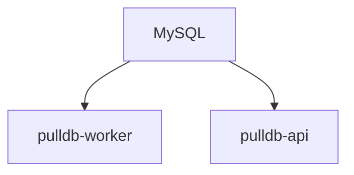

# Deployment Guide

[← Back to Documentation Index](START-HERE.md)

> **Version**: 0.2.0 | **Last Updated**: January 2026

This guide covers deploying and operating pullDB services in production environments.

**Related:** [Admin Guide](admin-guide.md) · [Architecture](architecture.md) · [KNOWLEDGE-POOL](KNOWLEDGE-POOL.md)

---

## Architecture Overview

```
┌─────────────────┐     ┌─────────────────┐     ┌─────────────────┐
│  pulldb CLI     │────▶│  pulldb-api     │────▶│    MySQL        │
│  (client)       │     │  (API service)  │     │  (coordination) │
└─────────────────┘     └─────────────────┘     └────────┬────────┘
                                                          │
                                                          ▼
                        ┌─────────────────┐     ┌─────────────────┐
                        │ pulldb-worker   │────▶│  S3 / myloader  │
                        │ (worker service)│     │  (backups)      │
                        └─────────────────┘     └─────────────────┘
```

**Components:**
- **API Service**: Receives restore requests, validates users, creates job records
- **Worker Service**: Polls for jobs, downloads backups, runs myloader restores
- **MySQL**: Coordination database - all state, queuing, and locking

---

## Directory Structure

```bash
/opt/pulldb.service/
├── bin/                    # dbmate, myloader binaries
├── config/
│   └── pulldb.yaml         # Main configuration
├── logs/                   # Service logs
├── migrations/             # Database migrations
├── scripts/                # Utility scripts
├── venv/                   # Python virtual environment
└── work/                   # Temporary work directory
```

---

## Services

### Worker Service

The worker is the core of pullDB. It polls MySQL for pending jobs, downloads backups from S3, and runs myloader restores.

**Service file:** `/etc/systemd/system/pulldb-worker.service`

```ini
[Unit]
Description=pullDB Restore Worker Daemon
After=network.target mysql.service
StartLimitIntervalSec=300
StartLimitBurst=5

[Service]
Type=simple
WorkingDirectory=/opt/pulldb.service
EnvironmentFile=/opt/pulldb.service/.env
ExecStart=/opt/pulldb.service/venv/bin/pulldb-worker
Restart=on-failure
RestartSec=5
User=pulldb_service
Group=pulldb_service
KillSignal=SIGTERM
TimeoutStopSec=30
NoNewPrivileges=true
PrivateTmp=true
ProtectSystem=full
LimitNOFILE=65535

[Install]
WantedBy=multi-user.target
```

**Commands:**
```bash
# Check status
sudo systemctl status pulldb-worker

# Start/stop/restart
sudo systemctl start pulldb-worker
sudo systemctl stop pulldb-worker
sudo systemctl restart pulldb-worker

# Enable on boot
sudo systemctl enable pulldb-worker

# View logs
sudo journalctl -u pulldb-worker -f
```

### API Service

The API provides an HTTP interface for the `pulldb` CLI to submit jobs and query status.

**Service file:** `/etc/systemd/system/pulldb-api.service`

```ini
[Unit]
Description=pullDB API Service
After=network.target mysql.service
StartLimitIntervalSec=300
StartLimitBurst=5

[Service]
Type=simple
WorkingDirectory=/opt/pulldb.service
EnvironmentFile=/opt/pulldb.service/.env
ExecStart=/opt/pulldb.service/venv/bin/pulldb-api
Restart=on-failure
RestartSec=5
User=pulldb_service
Group=pulldb_service
KillSignal=SIGTERM
TimeoutStopSec=30
NoNewPrivileges=true
PrivateTmp=true
ProtectSystem=full
LimitNOFILE=65535

[Install]
WantedBy=multi-user.target
```

**API Endpoints:**

| Method | Endpoint | Description |
|--------|----------|-------------|
| POST | `/api/jobs` | Create restore job |
| GET | `/api/jobs` | List jobs |
| GET | `/api/jobs/active` | List active jobs |
| GET | `/api/jobs/{job_id}/events` | Get job events |
| GET | `/api/jobs/{job_id}/profile` | Get job performance profile |
| POST | `/api/jobs/{job_id}/cancel` | Cancel a job |
| GET | `/api/health` | Health check |

---

## Configuration

### Main Configuration File

**Location:** `/opt/pulldb.service/config/pulldb.yaml`

```yaml
worker:
  poll_interval: 10        # Seconds between polling
  work_directory: /opt/pulldb.service/work
  max_concurrent_jobs: 2   # Per-worker limit

coordination_db:
  host: localhost
  port: 3306
  database: pulldb_service
  secret_id: aws-secretsmanager:/pulldb/mysql/coordination-db

s3:
  bucket: pulldb-production
  prefix: backups/

myloader:
  threads: 4
  overwrite_tables: true
```

### Environment Variables

| Variable | Description | Default |
|----------|-------------|---------|
| `PULLDB_CONFIG` | Config file path | `/opt/pulldb.service/config/pulldb.yaml` |
| `PULLDB_LOG_LEVEL` | Logging level | `INFO` |
| `PULLDB_WORK_DIR` | Work directory | `/opt/pulldb.service/work` |
| `PULLDB_COORDINATION_SECRET` | MySQL credentials secret | — |
| `PULLDB_AWS_PROFILE` | AWS profile name | (instance profile) |

---

## Security

### Service User

Both services run as the `pulldb` user with minimal privileges:

```bash
# Create user (during installation)
sudo useradd -r -s /bin/false pulldb
```

### AWS Credentials

**Production:** Use EC2 instance profile (no explicit credentials)

**Development:** Use AWS profiles:
```bash
# pr-dev: Secrets Manager access (development account)
# pr-staging: S3 read-only (staging backups)
# pr-prod: S3 read-only (production backups)
```

### Secrets Manager Controls

| Control | Implementation |
|---------|----------------|
| Credential redaction | `__repr__` redacts passwords in logs |
| Least privilege | IAM scoped to `/pulldb/mysql/*` |
| Encryption at rest | KMS encryption enforced |
| FAIL HARD on denial | Clear error messages for auth failures |

### S3 Controls

| Control | Implementation |
|---------|----------------|
| Read-only design | No write/delete methods |
| Input validation | Strict filename pattern matching |
| TLS enforcement | HTTPS for all API calls |
| Metadata-only discovery | `HeadObject` before download |

---

## Monitoring

### Health Checks

```bash
# Service status
sudo systemctl status pulldb-worker pulldb-api

# API health endpoint
curl http://localhost:8080/api/v1/health

# Queue depth
pulldb-admin jobs list --status=queued | wc -l

# Recent failures
pulldb-admin jobs list --status=failed --limit=10
```

### Key Metrics

| Metric | Alert Threshold | Action |
|--------|-----------------|--------|
| Service not running | Any stoppage | Restart service |
| Jobs pending > 10 | 30+ minutes | Check worker |
| Jobs failed (1h) | > 3 | Investigate errors |
| Disk space | < 10% free | Clean work directory |
| Memory usage | > 80% | Reduce myloader threads |

### Log Patterns to Watch

```bash
# Connection failures
sudo journalctl -u pulldb-worker | grep -i "connection refused"

# Database errors
sudo journalctl -u pulldb-worker | grep -i "mysql"

# S3 access issues
sudo journalctl -u pulldb-worker | grep -i "access denied"

# myloader failures
sudo journalctl -u pulldb-worker | grep -i "myloader.*error"
```

---

## Upgrade Process

### Using Debian Package

```bash
# Install new package (handles stop/start)
sudo dpkg -i pulldb_0.2.0_amd64.deb
```

### Manual Upgrade

```bash
# 1. Stop services
sudo systemctl stop pulldb-worker pulldb-api

# 2. Apply migrations
sudo pulldb-migrate up --yes

# 3. Update packages
sudo /opt/pulldb.service/venv/bin/pip install pulldb==0.2.0

# 4. Restart services
sudo systemctl start pulldb-worker pulldb-api

# 5. Verify
sudo systemctl status pulldb-worker pulldb-api
```

---

## Troubleshooting

### Service Won't Start

```bash
# Check configuration syntax
python3 -c "import yaml; yaml.safe_load(open('/opt/pulldb.service/config/pulldb.yaml'))"

# Check permissions
ls -la /opt/pulldb.service/

# Check MySQL connection
mysql -u pulldb_worker -p -e "SELECT 1"

# View startup errors
sudo journalctl -u pulldb-worker -n 50
```

### Jobs Not Processing

```bash
# Verify worker is running
sudo systemctl status pulldb-worker

# Check pending jobs
pulldb-admin jobs list --status=queued

# Check worker locks
mysql -e "SELECT * FROM pulldb_service.worker_locks"

# Check concurrency limits
pulldb-admin settings list
```

### High Memory Usage

```bash
# Check current usage
systemctl status pulldb-worker | grep Memory

# Reduce myloader threads (edit config)
# myloader.threads: 2

# Restart
sudo systemctl restart pulldb-worker
```

### Service Keeps Restarting

```bash
# View recent logs
sudo journalctl -u pulldb-worker -n 50

# Check restart count
systemctl show pulldb-worker | grep NRestarts

# Debug manually (disable auto-restart)
sudo systemctl stop pulldb-worker
/opt/pulldb.service/venv/bin/python -m pulldb.worker.service
```

---

## Backup & Recovery

### Configuration Backup

```bash
# Export settings
pulldb-admin settings export --format=json > settings-backup.json

# Backup config
cp /opt/pulldb.service/config/pulldb.yaml /opt/pulldb.service/config/pulldb.yaml.bak
```

### Service Recovery

```bash
# If coordination database is restored
sudo pulldb-migrate verify
sudo pulldb-migrate up --yes
sudo systemctl restart pulldb-worker pulldb-api
```

---

## Startup Order



1. `mysql.service` - Must be running first
2. `pulldb-worker.service` - After MySQL
3. `pulldb-api.service` - After MySQL (optional: after worker)

The systemd unit files enforce this ordering via `After=mysql.service` and `Requires=mysql.service`.

---

[← Back to Documentation Index](START-HERE.md) · [Architecture →](architecture.md)
