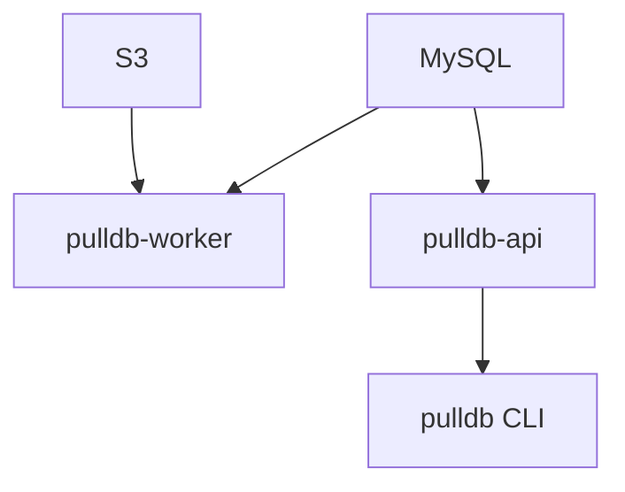

# pullDB Services Reference

> **Version**: 0.0.4 | **Last Updated**: November 28, 2025

pullDB runs as two systemd services: the **Worker Service** (processes restore jobs) and the **API Service** (receives job requests from clients).

---

## Architecture Overview

```
┌─────────────────┐     ┌─────────────────┐     ┌─────────────────┐
│  pulldb CLI     │────▶│  pulldb-api     │────▶│    MySQL        │
│  (client)       │     │  (API service)  │     │  (coordination) │
└─────────────────┘     └─────────────────┘     └────────┬────────┘
                                                          │
                                                          ▼
                        ┌─────────────────┐     ┌─────────────────┐
                        │ pulldb-worker   │────▶│  S3 / myloader  │
                        │ (worker service)│     │  (backups)      │
                        └─────────────────┘     └─────────────────┘
```

- **API Service**: Receives restore requests, validates users, creates job records
- **Worker Service**: Polls for pending jobs, downloads backups, runs myloader restores
- **MySQL**: Coordination database - all state, queuing, and locking

---

## Worker Service

### Overview

The worker service is the heart of pullDB. It:
1. Polls MySQL for pending jobs
2. Acquires exclusive locks per target host
3. Downloads backups from S3
4. Runs myloader to restore databases
5. Executes post-restore SQL
6. Cleans up staging databases

### Installation Location

```bash
/opt/pulldb.service/
├── bin/                    # dbmate, myloader binaries
├── config/                 # Configuration files
├── logs/                   # Service logs
├── migrations/             # Database migrations
├── scripts/                # Utility scripts
├── venv/                   # Python virtual environment
└── work/                   # Temporary work directory
```

### Configuration

**Primary configuration file:**
```bash
/opt/pulldb.service/config/pulldb.yaml
```

**Example configuration:**
```yaml
# Worker settings
worker:
  poll_interval: 10        # Seconds between polling for new jobs
  work_dir: /opt/pulldb.service/work
  max_concurrent_jobs: 2   # Per-worker limit (Phase 2)

# MySQL coordination database
coordination_db:
  host: localhost
  port: 3306
  database: pulldb_service
  secret_id: aws-secretsmanager:/pulldb/mysql/coordination-db

# S3 backup source
s3:
  bucket: pulldb-production
  prefix: backups/

# myloader settings
myloader:
  threads: 4
  overwrite_tables: true
```

**Environment variables:**

| Variable | Description | Default |
|----------|-------------|---------|
| `PULLDB_CONFIG` | Path to config file | `/opt/pulldb.service/config/pulldb.yaml` |
| `PULLDB_LOG_LEVEL` | Logging level | `INFO` |
| `PULLDB_WORK_DIR` | Temporary work directory | `/opt/pulldb.service/work` |
| `PULLDB_COORDINATION_SECRET` | AWS secret for MySQL credentials | — |

### systemd Management

**Service file:**
```bash
/etc/systemd/system/pulldb-worker.service
```

**Commands:**
```bash
# Check status
sudo systemctl status pulldb-worker

# Start/stop/restart
sudo systemctl start pulldb-worker
sudo systemctl stop pulldb-worker
sudo systemctl restart pulldb-worker

# Enable/disable on boot
sudo systemctl enable pulldb-worker
sudo systemctl disable pulldb-worker

# View logs
sudo journalctl -u pulldb-worker -f          # Follow logs
sudo journalctl -u pulldb-worker --since "1 hour ago"
sudo journalctl -u pulldb-worker -n 100      # Last 100 lines
```

### Service File Contents

```ini
[Unit]
Description=pullDB Worker Service
After=mysql.service
Requires=mysql.service

[Service]
Type=simple
User=pulldb
Group=pulldb
WorkingDirectory=/opt/pulldb.service
Environment=PULLDB_CONFIG=/opt/pulldb.service/config/pulldb.yaml
ExecStart=/opt/pulldb.service/venv/bin/python -m pulldb.worker.service
Restart=always
RestartSec=10

[Install]
WantedBy=multi-user.target
```

### Log Files

```bash
# systemd journal (primary)
sudo journalctl -u pulldb-worker -f

# File logs (if configured)
/opt/pulldb.service/logs/worker.log
```

**Log format:**
```
2025-11-28 12:34:56,789 - pulldb.worker.service - INFO - Starting worker service
2025-11-28 12:34:57,123 - pulldb.worker.service - INFO - Polling for pending jobs
2025-11-28 12:34:57,456 - pulldb.worker.service - INFO - Processing job abc123
2025-11-28 12:35:00,789 - pulldb.worker.restore - INFO - Download started: s3://bucket/backup.sql.gz
2025-11-28 12:36:00,123 - pulldb.worker.restore - INFO - myloader started: 4 threads
2025-11-28 12:40:00,456 - pulldb.worker.service - INFO - Job abc123 completed successfully
```

### Health Checks

```bash
# Is service running?
sudo systemctl is-active pulldb-worker

# Check for errors
sudo journalctl -u pulldb-worker -p err --since "1 hour ago"

# Check active jobs in database
pulldb-admin jobs --active

# Check worker locks
sudo mysql -e "SELECT * FROM pulldb_service.worker_locks"
```

---

## API Service

### Overview

The API service provides an HTTP interface for clients to:
- Submit restore requests
- Query job status
- View job history
- Cancel pending jobs

### Installation Location

```bash
/opt/pulldb.api/
├── config/                 # Configuration files
├── logs/                   # Service logs
└── venv/                   # Python virtual environment
```

### Configuration

**Primary configuration file:**
```bash
/opt/pulldb.api/config/pulldb-api.yaml
```

**Example configuration:**
```yaml
# API server settings
server:
  host: 0.0.0.0
  port: 8080
  workers: 4

# Authentication
auth:
  secret_id: aws-secretsmanager:/pulldb/api/auth

# Coordination database
coordination_db:
  host: localhost
  port: 3306
  database: pulldb_service
  secret_id: aws-secretsmanager:/pulldb/mysql/coordination-db
```

### systemd Management

**Service file:**
```bash
/etc/systemd/system/pulldb-api.service
```

**Commands:**
```bash
# Check status
sudo systemctl status pulldb-api

# Start/stop/restart
sudo systemctl start pulldb-api
sudo systemctl stop pulldb-api
sudo systemctl restart pulldb-api

# Enable/disable on boot
sudo systemctl enable pulldb-api
sudo systemctl disable pulldb-api

# View logs
sudo journalctl -u pulldb-api -f
```

### Service File Contents

```ini
[Unit]
Description=pullDB API Service
After=mysql.service
Wants=pulldb-worker.service

[Service]
Type=simple
User=pulldb
Group=pulldb
WorkingDirectory=/opt/pulldb.api
Environment=PULLDB_CONFIG=/opt/pulldb.api/config/pulldb-api.yaml
ExecStart=/opt/pulldb.api/venv/bin/python -m pulldb.api.server
Restart=always
RestartSec=10

[Install]
WantedBy=multi-user.target
```

### API Endpoints

| Method | Endpoint | Description |
|--------|----------|-------------|
| POST | `/api/v1/jobs` | Create new restore job |
| GET | `/api/v1/jobs/{job_id}` | Get job details |
| GET | `/api/v1/jobs/{job_id}/status` | Get job status |
| GET | `/api/v1/jobs/{job_id}/events` | Get job events |
| POST | `/api/v1/jobs/{job_id}/cancel` | Cancel a job |
| GET | `/api/v1/users/{user}/jobs` | Get user's job history |
| GET | `/api/v1/health` | Health check endpoint |

### Health Check

```bash
# Check API is responding
curl http://localhost:8080/api/v1/health

# Response
{
  "status": "healthy",
  "version": "0.0.4",
  "database": "connected",
  "worker": "running"
}
```

---

## Service Dependencies



### Startup Order

1. `mysql.service` - Must be running first
2. `pulldb-worker.service` - Can start after MySQL
3. `pulldb-api.service` - Can start after MySQL

### Dependency Configuration

Both services declare MySQL dependency in their systemd unit files:

```ini
[Unit]
After=mysql.service
Requires=mysql.service    # Hard dependency (worker)
Wants=mysql.service       # Soft dependency (API)
```

---

## Upgrade Process

### Using Upgrade Script

```bash
sudo /opt/pulldb.service/scripts/upgrade_pulldb.sh
```

This script:
1. Stops the worker service
2. Backs up configuration
3. Applies database migrations
4. Updates Python packages
5. Restarts services

### Manual Upgrade

```bash
# Stop services
sudo systemctl stop pulldb-worker pulldb-api

# Apply migrations
sudo pulldb-migrate up --yes

# Update packages
sudo /opt/pulldb.service/venv/bin/pip install pulldb==0.0.4

# Restart services
sudo systemctl start pulldb-worker pulldb-api

# Verify
sudo systemctl status pulldb-worker pulldb-api
```

### Package Upgrade (Debian)

```bash
# Install new package (stops/starts services automatically)
sudo dpkg -i pulldb_0.0.4_amd64.deb
```

---

## Monitoring

### Key Metrics

| Metric | Source | Alert Threshold |
|--------|--------|-----------------|
| Service running | systemd | Not active |
| Jobs pending | MySQL query | > 10 for > 30 min |
| Jobs failed (1h) | MySQL query | > 3 |
| Disk space | df | < 10% free |
| Memory usage | systemd | > 80% |

### Monitoring Commands

```bash
# Service health
sudo systemctl status pulldb-worker pulldb-api

# Queue depth
pulldb-admin jobs --pending | wc -l

# Recent failures
pulldb-admin jobs --failed --limit 10

# Disk usage
df -h /opt/pulldb.service/work

# Memory usage
systemctl status pulldb-worker | grep Memory
```

### Log Alerts

Watch for these patterns in logs:

```bash
# Connection failures
sudo journalctl -u pulldb-worker | grep -i "connection refused"

# Database errors
sudo journalctl -u pulldb-worker | grep -i "mysql"

# S3 access issues
sudo journalctl -u pulldb-worker | grep -i "access denied"

# myloader failures
sudo journalctl -u pulldb-worker | grep -i "myloader.*error"
```

---

## Troubleshooting

### Service Won't Start

```bash
# Check configuration
cat /opt/pulldb.service/config/pulldb.yaml

# Validate syntax
python3 -c "import yaml; yaml.safe_load(open('/opt/pulldb.service/config/pulldb.yaml'))"

# Check permissions
ls -la /opt/pulldb.service/

# Check MySQL connection
mysql -u pulldb_worker -p -e "SELECT 1"
```

### Jobs Not Processing

```bash
# Check worker is running
sudo systemctl status pulldb-worker

# Check for pending jobs
pulldb-admin jobs --pending

# Check worker locks
sudo mysql -e "SELECT * FROM pulldb_service.worker_locks"

# Check concurrency limits
pulldb-admin settings
```

### High Memory Usage

```bash
# Check current usage
systemctl status pulldb-worker | grep Memory

# Reduce myloader threads
# Edit /opt/pulldb.service/config/pulldb.yaml
# myloader:
#   threads: 2  # Reduce from 4

# Restart service
sudo systemctl restart pulldb-worker
```

### Service Keeps Restarting

```bash
# Check logs for cause
sudo journalctl -u pulldb-worker -n 50

# Check restart count
systemctl show pulldb-worker | grep NRestarts

# Temporarily disable auto-restart for debugging
sudo systemctl stop pulldb-worker
sudo /opt/pulldb.service/venv/bin/python -m pulldb.worker.service
```

---

## Security

### Service User

Both services run as the `pulldb` user:

```bash
# Verify user exists
id pulldb

# Check service runs as pulldb
ps aux | grep pulldb
```

### File Permissions

```bash
# Configuration (readable by pulldb only)
chmod 640 /opt/pulldb.service/config/pulldb.yaml
chown root:pulldb /opt/pulldb.service/config/pulldb.yaml

# Work directory (writable by pulldb)
chmod 750 /opt/pulldb.service/work
chown pulldb:pulldb /opt/pulldb.service/work
```

### Network Access

| Service | Port | Access |
|---------|------|--------|
| Worker | None | Internal only |
| API | 8080 | Via load balancer/proxy |
| MySQL | 3306 | Localhost only |

### AWS IAM

The worker service needs these IAM permissions:

```json
{
  "Version": "2012-10-17",
  "Statement": [
    {
      "Effect": "Allow",
      "Action": [
        "s3:GetObject",
        "s3:ListBucket"
      ],
      "Resource": [
        "arn:aws:s3:::pulldb-production",
        "arn:aws:s3:::pulldb-production/*"
      ]
    },
    {
      "Effect": "Allow",
      "Action": [
        "secretsmanager:GetSecretValue"
      ],
      "Resource": [
        "arn:aws:secretsmanager:*:*:secret:/pulldb/*"
      ]
    }
  ]
}
```
